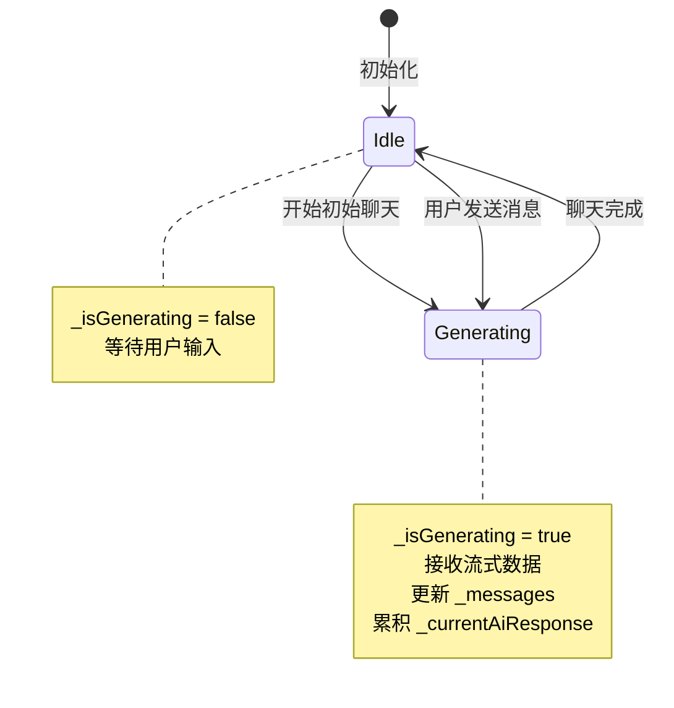
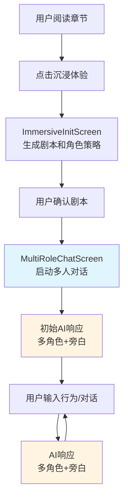

# 多人对话互动功能 - 详细设计文档

## 项目概述

**功能名称**：多人对话互动的沉浸式剧情体验

**核心设计**：AI扮演所有角色与用户进行互动，通过统一聊天流展示旁白和多角色对话。

**创建日期**：2025-01-24
**版本**：1.0

---

## 目录

1. [核心逻辑与数据流](#1-核心逻辑与数据流)
2. [数据模型设计](#2-数据模型设计)
3. [流式解析器设计](#3-流式解析器设计)
4. [UI设计](#4-ui设计)
5. [状态管理](#5-状态管理)
6. [集成点与启动流程](#6-集成点与启动流程)
7. [错误处理](#7-错误处理)
8. [测试策略](#8-测试策略)

---

## 1. 核心逻辑与数据流

### 1.1 系统架构理解

```
┌─────────────────────────────────────────────────────────┐
│              AI扮演所有角色的沉浸式对话系统              │
└─────────────────────────────────────────────────────────┘

用户输入 → AI响应 → 解析显示 → 累积历史 → 下一轮
   ↓          ↓         ↓          ↓          ↓
 行为/对话  多角色+旁白  聊天气泡   原始文本   AI推理
```

**核心理解**：
- 不是真正的多角色系统，而是一个AI统一管理所有角色
- 每个回合：用户发送行为/对话 → AI返回完整响应（包含旁白+多角色对话）
- 历史记录用于AI推理上下文

### 1.2 Dify返回格式示例

```
今天的讨论很有意义<角色A>

同意，我们需要深入探讨<角色B>

让我再想想<角色C>

</角色C>

这个问题很复杂<角色A>

大家都说得很有道理<角色B>
```

**解析规则**：
- 纯文本 → 旁白消息（灰色斜体显示）
- `<角色名>` → 开始角色对话
- `</角色名>` → 结束角色对话
- `<用户>` → 用户消息（仅用于历史记录，不在AI响应中出现）

### 1.3 历史记录管理

```dart
// 数据结构
final List<String> _chatHistory = [];

// AI响应完成时
void _onAiResponseComplete() {
  // _currentAiResponse 是累积的原始文本（包含<角色名>标签）
  _chatHistory.add(_currentAiResponse);
  _currentAiResponse = '';
}

// 用户发送消息时
void _onUserSend(String action, String speech) {
  final userInput = '<用户>行为:$action\n对话:$speech</用户>';
  _chatHistory.add(userInput);
}

// 发送给Dify时用换行符连接
final chatHistoryString = _chatHistory.join('\n');
```

**历史记录示例**：

```dart
_chatHistory = [
  // 第1回合：AI的完整响应（原始文本）
  '大家今天都来得真早啊<角色A>是的，我总是第一个到<角色A>，这是今天的议题<角色C>欢迎加入我们的讨论<角色B>今天天气真不错</角色B></角色B></角色A></角色C>很高兴见到大家<角色A>',

  // 第2回合：用户的输入
  '<用户>行为:环顾四周\n对话:这里的环境真不错</用户>',

  // 第3回合：AI的完整响应
  '阳光透过树叶洒在地面上<角色A>欢迎来到我们的领地</角色A><角色B>请问你需要什么帮助吗？</角色B><角色C>很高兴见到你</角色C>',

  // 第4回合：用户的输入
  '<用户>行为:点头\n对话:谢谢</用户>',
]
```

### 1.4 数据流图

```mermaid
sequenceDiagram
    participant U as 用户
    participant M as MultiRoleChatScreen
    participant P as ChatStreamParser
    participant D as DifyService

    U->>M: 初始启动
    M->>D: runWorkflowStreaming<br/>(cmd: '聊天', scene: play)
    D-->>M: 流式返回原始文本
    M->>P: parseChunkForMultiRole(chunk)
    P-->>M: ParseResult(messages, inDialogue)
    M->>U: 实时显示消息气泡

    U->>M: 输入行为/对话
    M->>M: 显示用户消息
    M->>M: _chatHistory.add(userInput)
    M->>D: runWorkflowStreaming<br/>(user_input, chat_history)
    D-->>M: 流式返回原始文本
    M->>P: parseChunkForMultiRole(chunk)
    P-->>M: ParseResult(messages, inDialogue)
    M->>U: 实时显示消息气泡
    M->>M: _chatHistory.add(aiResponse)
```



---

## 2. 数据模型设计

### 2.1 ChatMessage（已存在，无需修改）

```dart
class ChatMessage {
  final String type;           // 'narration' | 'dialogue' | 'user_action' | 'user_speech'
  final String content;
  final Character? character;  // 对话类型时关联的角色
  final bool isUser;           // 是否为用户消息

  ChatMessage.narration(this.content)
      : type = 'narration',
        character = null,
        isUser = false;

  ChatMessage.dialogue(this.content, this.character)
      : type = 'dialogue',
        isUser = false;

  ChatMessage.userAction(this.content)
      : type = 'user_action',
        character = null,
        isUser = true;

  ChatMessage.userSpeech(this.content)
      : type = 'user_speech',
        character = null,
        isUser = true;

  ChatMessage copyWith({String? content}) {
    return ChatMessage(
      type: type,
      content: content ?? this.content,
      character: character,
      isUser: isUser,
    );
  }
}
```

### 2.2 Character（已存在，无需修改）

```dart
class Character {
  final String? id;
  final String novelUrl;
  final String name;
  final String? gender;
  final int? age;
  final String? occupation;
  final String? personality;
  final String? bodyType;
  final String? clothingStyle;
  final String? appearanceFeatures;
  final String? backgroundStory;
  final String? cachedImageUrl;
}
```

---

## 3. 流式解析器设计

### 3.1 ChatStreamParser扩展

在 `lib/utils/chat_stream_parser.dart` 中添加新方法：

```dart
/// 解析多角色流式文本
///
/// 参数：
/// - [chunk] 新接收的文本块
/// - [currentMessages] 当前消息列表
/// - [allCharacters] 所有角色列表
/// - [inDialogue] 当前是否在对话模式中
///
/// 返回：更新后的消息列表和新的对话状态
static ParseResult parseChunkForMultiRole(
  String chunk,
  List<ChatMessage> currentMessages,
  List<Character> allCharacters,
  bool inDialogue,
) {
  List<ChatMessage> messages = List.from(currentMessages);
  Character? currentCharacter;

  // 如果已经在对话中，找到当前角色
  if (inDialogue && messages.isNotEmpty && messages.last.type == 'dialogue') {
    currentCharacter = messages.last.character;
  }

  // 逐字符解析
  for (int i = 0; i < chunk.length; i++) {
    final char = chunk[i];

    if (char == '<') {
      // 检测标签
      final tagContent = _extractTag(chunk, i);
      if (tagContent != null) {
        final tagLength = tagContent.length + 2; // 包括 < 和 >
        i += tagLength - 1; // 跳过标签（循环会+1）

        if (tagContent.startsWith('/')) {
          // 闭合标签 </角色名>
          final tagName = tagContent.substring(1);
          if (currentCharacter?.name == tagName) {
            currentCharacter = null; // 结束对话
          }
        } else {
          // 开放标签 <角色名>
          final character = _findCharacter(tagContent, allCharacters);
          if (character != null) {
            currentCharacter = character;
            messages.add(ChatMessage.dialogue('', character));
          }
        }
        continue;
      }
    }

    // 处理普通字符
    if (currentCharacter != null) {
      // 角色对话模式
      _appendToDialogue(messages, char, currentCharacter);
    } else {
      // 旁白模式
      _appendToNarration(messages, char);
    }
  }

  return ParseResult(
    messages: messages,
    inDialogue: currentCharacter != null,
  );
}

/// 提取标签内容
/// 返回: 标签名（不包含 < 和 >），如果不是有效标签返回 null
static String? _extractTag(String chunk, int startIndex) {
  if (startIndex >= chunk.length || chunk[startIndex] != '<') return null;

  final endIndex = chunk.indexOf('>', startIndex);
  if (endIndex == -1) return null;

  return chunk.substring(startIndex + 1, endIndex);
}

/// 查找角色
static Character? _findCharacter(String name, List<Character> characters) {
  try {
    return characters.firstWhere((c) => c.name == name);
  } catch (e) {
    debugPrint('⚠️ 未找到角色: $name');
    return null;
  }
}

/// 追加到对话
static void _appendToDialogue(
  List<ChatMessage> messages,
  String char,
  Character character,
) {
  if (messages.isEmpty ||
      messages.last.type != 'dialogue' ||
      messages.last.character != character) {
    messages.add(ChatMessage.dialogue(char, character));
  } else {
    final lastMessage = messages.last;
    messages[messages.length - 1] = ChatMessage.dialogue(
      lastMessage.content + char,
      character,
    );
  }
}

/// 追加到旁白
static void _appendToNarration(List<ChatMessage> messages, String char) {
  if (messages.isEmpty || messages.last.type != 'narration') {
    messages.add(ChatMessage.narration(char));
  } else {
    final lastMessage = messages.last;
    messages[messages.length - 1] = ChatMessage.narration(
      lastMessage.content + char,
    );
  }
}
```

### 3.2 解析逻辑说明

**逐字符解析的优势**：
- 支持流式更新，实时显示
- 准确识别标签边界
- 易于调试和维护

**状态机**：
```
初始状态 (inDialogue=false)
    ↓
收到 '<角色名>'
    ↓
对话状态 (inDialogue=true, currentCharacter=角色)
    ↓
收到 '</角色名>'
    ↓
回到旁白状态 (inDialogue=false, currentCharacter=null)
```

---

## 4. UI设计

### 4.1 RoleColorManager工具类

新建 `lib/utils/role_color_manager.dart`：

```dart
import 'package:flutter/material.dart';
import '../models/character.dart';

class RoleColorManager {
  static const List<Color> _roleColors = [
    Color(0xFF1E3A5F), // 深蓝色
    Color(0xFF1F3D2F), // 深绿色
    Color(0xFF3D1E5F), // 深紫色
    Color(0xFF5F3D1E), // 深棕色
    Color(0xFF5F1E3D), // 深红色
    Color(0xFF1E5F3D), // 青绿色
    Color(0xFF5F5F1E), // 深黄色
    Color(0xFF3D3D3D), // 深灰色
  ];

  /// 为角色分配颜色
  static Map<String, Color> assignColors(List<Character> characters) {
    final Map<String, Color> colorMap = {};

    for (int i = 0; i < characters.length; i++) {
      final colorIndex = i % _roleColors.length;
      colorMap[characters[i].name] = _roleColors[colorIndex];
    }

    return colorMap;
  }

  /// 获取角色颜色
  static Color getColor(String characterName, Map<String, Color> colorMap) {
    return colorMap[characterName] ?? _roleColors.first;
  }
}
```

### 4.2 MultiRoleChatScreen UI结构

```
┌────────────────────────────────────────────────┐
│ AppBar: 沉浸式对话                               │
│        角色：角色A、角色B、角色C          [info] │
├────────────────────────────────────────────────┤
│                                                │
│ ┌──────────────────────────────────────────┐  │
│ │ [角色A头像]  ┌─────────────────────┐     │  │
│ │  🟡蓝色      │ 角色A的对话内容      │     │  │
│ │              └─────────────────────┘     │  │
│ └──────────────────────────────────────────┘  │
│                                                │
│     *旁白内容显示为斜体灰色文本*                │
│                                                │
│ ┌──────────────────────────────────────────┐  │
│ │ [角色B头像]  ┌─────────────────────┐     │  │
│ │  🟢绿色      │ 角色B的对话内容      │     │  │
│ │              └─────────────────────┘     │  │
│ └──────────────────────────────────────────┘  │
│                                                │
│                        ┌──────────┐           │
│                        │用户消息   │           │
│                        └──────────┘           │
│                                                │
├────────────────────────────────────────────────┤
│ [👥 正在与 角色A、角色B、角色C 对话]           │
│                                                │
│ 行为 (可选): [___________________]             │
│                                                │
│ 对话 (可选): [___________________]             │
│              [___________________]             │
│                                                │
│              [  发送消息  ]                    │
└────────────────────────────────────────────────┘
```

### 4.3 消息气泡设计

#### 旁白气泡
```dart
Widget _buildNarrationBubble(ChatMessage message) {
  return Container(
    margin: const EdgeInsets.symmetric(vertical: 8),
    padding: const EdgeInsets.symmetric(horizontal: 16, vertical: 8),
    child: Text(
      message.content,
      style: TextStyle(
        color: _DarkThemeColors.hintText,
        fontStyle: FontStyle.italic,
        fontSize: 14,
        height: 1.5,
      ),
    ),
  );
}
```

#### 角色对话气泡
```dart
Widget _buildDialogueBubble(ChatMessage message) {
  final character = message.character!;
  final color = _roleColors[character.name] ?? _DarkThemeColors.roleBubbleBackground;

  return Container(
    margin: const EdgeInsets.symmetric(vertical: 8),
    child: Row(
      crossAxisAlignment: CrossAxisAlignment.start,
      children: [
        // 角色头像
        _buildCharacterAvatar(character, color),
        const SizedBox(width: 8),

        // 对话气泡
        Expanded(
          child: Container(
            padding: const EdgeInsets.all(12),
            decoration: BoxDecoration(
              color: color.withOpacity(0.2),
              borderRadius: BorderRadius.circular(12),
              border: Border.all(color: color, width: 2),
            ),
            child: Row(
              crossAxisAlignment: CrossAxisAlignment.start,
              children: [
                Expanded(
                  child: Text(
                    message.content,
                    style: const TextStyle(
                      fontSize: 15,
                      height: 1.5,
                      color: _DarkThemeColors.primaryText,
                    ),
                  ),
                ),
                // 流式输出指示器
                if (_isGenerating && message == _messages.last)
                  _buildTypingIndicator(),
              ],
            ),
          ),
        ),
      ],
    ),
  );
}
```

#### 用户消息气泡
```dart
Widget _buildUserBubble(ChatMessage message) {
  return Container(
    margin: const EdgeInsets.symmetric(vertical: 8),
    child: Align(
      alignment: Alignment.centerRight,
      child: Container(
        padding: const EdgeInsets.all(12),
        decoration: BoxDecoration(
          color: _DarkThemeColors.userBubbleBackground,
          borderRadius: BorderRadius.circular(12),
          border: Border.all(
            color: _DarkThemeColors.userBubbleBorder,
            width: 2,
          ),
        ),
        child: Text(
          message.content,
          style: const TextStyle(
            fontSize: 15,
            height: 1.5,
            color: _DarkThemeColors.primaryText,
          ),
        ),
      ),
    ),
  );
}
```

### 4.4 角色头像设计

```dart
Widget _buildCharacterAvatar(Character character, Color color) {
  return FutureBuilder<String?>(
    future: character.id != null
        ? _avatarService.getCharacterAvatarPath(character.id!)
        : Future.value(null),
    builder: (context, snapshot) {
      final avatarPath = snapshot.data;

      if (avatarPath != null && File(avatarPath).existsSync()) {
        return Container(
          width: 40,
          height: 40,
          decoration: BoxDecoration(
            shape: BoxShape.circle,
            border: Border.all(color: color, width: 2),
          ),
          child: ClipOval(
            child: Image.file(
              File(avatarPath),
              fit: BoxFit.cover,
              errorBuilder: (context, error, stackTrace) {
                return _buildFallbackAvatar(character, color);
              },
            ),
          ),
        );
      }

      return _buildFallbackAvatar(character, color);
    },
  );
}

Widget _buildFallbackAvatar(Character character, Color color) {
  return Container(
    width: 40,
    height: 40,
    decoration: BoxDecoration(
      color: color.withOpacity(0.3),
      shape: BoxShape.circle,
      border: Border.all(color: color, width: 2),
    ),
    child: Center(
      child: Text(
        character.name.isNotEmpty ? character.name[0].toUpperCase() : '?',
        style: TextStyle(
          fontSize: 18,
          fontWeight: FontWeight.bold,
          color: color,
        ),
      ),
    ),
  );
}
```

---

## 5. 状态管理

### 5.1 状态变量

```dart
class _MultiRoleChatScreenState extends State<MultiRoleChatScreen> {
  // 消息列表
  List<ChatMessage> _messages = [];

  // 生成状态
  bool _isGenerating = false;

  // 解析状态
  bool _inDialogue = false;  // 是否在角色对话中

  // AI响应累积（用于历史记录）
  String _currentAiResponse = '';

  // 聊天历史
  final List<String> _chatHistory = [];

  // 控制器
  final TextEditingController _actionController = TextEditingController();
  final TextEditingController _speechController = TextEditingController();
  final ScrollController _scrollController = ScrollController();

  // 服务
  final DifyService _difyService = DifyService();
  final CharacterAvatarService _avatarService = CharacterAvatarService();

  // 角色颜色映射
  late Map<String, Color> _roleColors;
}
```

### 5.2 状态转换



---

## 6. 集成点与启动流程

### 6.1 修改ImmersiveInitScreen

在 `lib/widgets/immersive/immersive_init_screen.dart` 中：

```dart
/// 确认剧本（启动多人对话）
void _confirmScript() {
  Navigator.pushReplacement(
    context,
    MaterialPageRoute(
      builder: (context) => MultiRoleChatScreen(
        characters: widget.config.characters,
        play: _play!,
        roleStrategy: _roleStrategy!,
      ),
    ),
  );
}
```

### 6.2 启动流程



---

## 7. 错误处理

### 7.1 网络错误

```dart
try {
  await _difyService.runWorkflowStreaming(...);
} catch (e) {
  setState(() {
    _isGenerating = false;
  });

  _showErrorSnackBar('网络错误：$e');
  _showRetryDialog();
}

void _showRetryDialog() {
  showDialog(
    context: context,
    builder: (context) => AlertDialog(
      title: const Text('连接失败'),
      content: const Text('是否重试？'),
      actions: [
        TextButton(
          onPressed: () => Navigator.pop(context),
          child: const Text('取消'),
        ),
        ElevatedButton(
          onPressed: () {
            Navigator.pop(context);
            _retryLastRequest();
          },
          child: const Text('重试'),
        ),
      ],
    ),
  );
}
```

### 7.2 角色未匹配

```dart
static Character? _findCharacter(String name, List<Character> characters) {
  try {
    return characters.firstWhere((c) => c.name == name);
  } catch (e) {
    debugPrint('⚠️ 未找到角色: $name');
    return null;
  }
}

// 在解析时处理
if (character != null) {
  messages.add(ChatMessage.dialogue('', character));
} else {
  debugPrint('⚠️ 未知角色标签: $tagContent');
  // 作为旁白处理
  _appendToNarration(messages, '<$tagContent>');
}
```

### 7.3 标签不匹配

```dart
if (tagContent.startsWith('/')) {
  final tagName = tagContent.substring(1);
  if (currentCharacter == null) {
    debugPrint('⚠️ 多余的闭合标签: </$tagName>');
    // 作为普通文本处理
    _appendToNarration(messages, '</$tagName>');
  } else if (currentCharacter.name != tagName) {
    debugPrint('⚠️ 标签不匹配: 期望</${currentCharacter.name}>, 实际</$tagName>');
    // 作为普通文本处理
    _appendToNarration(messages, '</$tagName>');
  } else {
    currentCharacter = null;
  }
}
```

### 7.4 消息数量限制

```dart
setState(() {
  // 保留最新100条消息
  _messages = result.messages.length > 100
      ? result.messages.sublist(result.messages.length - 100)
      : result.messages;
});
```

---

## 8. 测试策略

### 8.1 单元测试

文件：`test/utils/chat_stream_parser_test.dart`

```dart
void main() {
  group('ChatStreamParser.parseChunkForMultiRole', () {
    final characters = [
      Character(novelUrl: '', name: '角色A'),
      Character(novelUrl: '', name: '角色B'),
    ];

    test('应该解析旁白', () {
      final result = ChatStreamParser.parseChunkForMultiRole(
        '这是旁白内容',
        [],
        characters,
        false,
      );

      expect(result.messages.length, 1);
      expect(result.messages.first.type, 'narration');
      expect(result.messages.first.content, '这是旁白内容');
      expect(result.inDialogue, false);
    });

    test('应该解析角色对话', () {
      final result = ChatStreamParser.parseChunkForMultiRole(
        '<角色A>你好</角色A>',
        [],
        characters,
        false,
      );

      expect(result.messages.length, 1);
      expect(result.messages.first.type, 'dialogue');
      expect(result.messages.first.character?.name, '角色A');
      expect(result.messages.first.content, '你好');
      expect(result.inDialogue, false);
    });

    test('应该解析多角色对话', () {
      final result = ChatStreamParser.parseChunkForMultiRole(
        '旁白<角色A>你好</角色A>旁白<角色B>你好</角色B>',
        [],
        characters,
        false,
      );

      expect(result.messages.length, 5);
      expect(result.messages[0].type, 'narration');
      expect(result.messages[1].type, 'dialogue');
      expect(result.messages[1].character?.name, '角色A');
      expect(result.messages[2].type, 'narration');
      expect(result.messages[3].type, 'dialogue');
      expect(result.messages[3].character?.name, '角色B');
      expect(result.messages[4].type, 'narration');
    });

    test('应该处理流式更新', () {
      // 第一次接收
      var result = ChatStreamParser.parseChunkForMultiRole(
        '<角色A>你',
        [],
        characters,
        false,
      );

      expect(result.messages.length, 1);
      expect(result.messages.first.content, '你');
      expect(result.inDialogue, true);

      // 第二次接收
      result = ChatStreamParser.parseChunkForMultiRole(
        '好',
        result.messages,
        characters,
        result.inDialogue,
      );

      expect(result.messages.length, 1);
      expect(result.messages.first.content, '你好');
      expect(result.inDialogue, true);

      // 第三次接收
      result = ChatStreamParser.parseChunkForMultiRole(
        '</角色A>',
        result.messages,
        characters,
        result.inDialogue,
      );

      expect(result.messages.length, 1);
      expect(result.messages.first.content, '你好');
      expect(result.inDialogue, false);
    });
  });
}
```

### 8.2 集成测试

**测试场景**：

1. **完整的对话流程**
   - 初始聊天 → 用户输入 → AI响应 → 用户输入 → AI响应
   - 验证历史记录正确累积
   - 验证UI正确更新

2. **历史记录传递**
   - 验证 `_chatHistory` 正确传递给Dify
   - 验证用户输入用 `<用户>` 包裹
   - 验证AI响应无包裹标签

3. **网络错误处理**
   - 模拟网络错误
   - 验证错误提示显示
   - 验证重试功能

4. **边界情况**
   - 消息数量超过100条
   - 角色名不匹配
   - 标签未闭合
   - 空消息

### 8.3 UI测试

**测试项**：

1. **角色颜色分配**
   - 多个角色颜色不同
   - 颜色循环复用

2. **头像显示**
   - 自定义头像加载
   - 默认头像显示
   - 头像加载失败处理

3. **消息气泡**
   - 旁白正确显示（灰色斜体）
   - 对话正确显示（气泡+头像）
   - 用户消息正确显示（右侧气泡）

4. **滚动性能**
   - 自动滚动到底部
   - 滚动流畅度
   - 长消息列表性能

---

## 附录

### A. 相关文件清单

**新建文件**：
- `novel_app/lib/screens/multi_role_chat_screen.dart`
- `novel_app/lib/utils/role_color_manager.dart`
- `novel_app/test/utils/chat_stream_parser_test.dart`

**修改文件**：
- `novel_app/lib/utils/chat_stream_parser.dart`
- `novel_app/lib/widgets/immersive/immersive_init_screen.dart`

### B. 技术栈

- Flutter 3.0+
- Dart SDK
- Dify Service（AI服务）
- Character Avatar Service（头像服务）

### C. 参考资料

- 现有 `CharacterChatScreen` 实现
- Dify API 文档
- Flutter 官方文档

---

**文档版本**：1.0
**创建日期**：2025-01-24
**最后更新**：2025-01-24
**作者**：Claude Code
