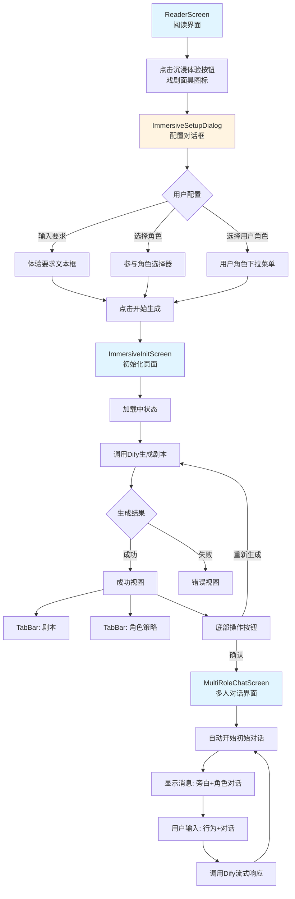
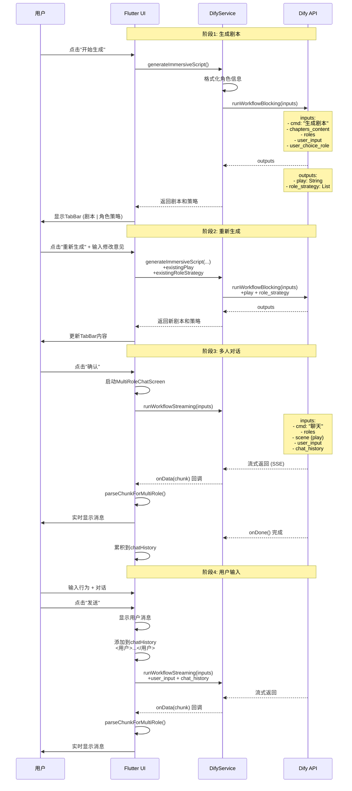
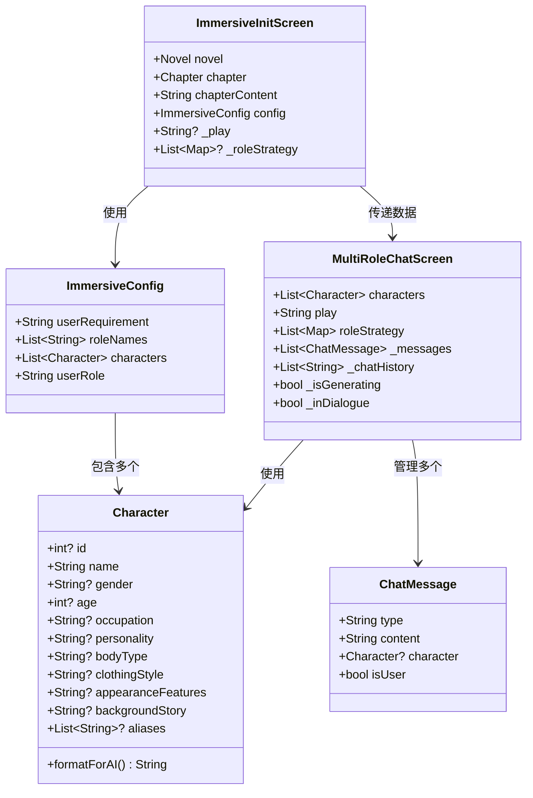
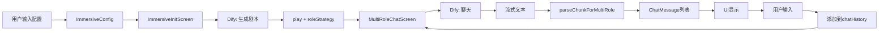

# 沉浸式体验功能 - UI逻辑流程与Dify交互详解

## 文档版本
- **创建日期**: 2025-01-24
- **版本**: 1.0
- **作者**: Claude Code

---

## 目录
1. [完整UI流程](#1-完整ui流程)
2. [Dify交互详解](#2-dify交互详解)
3. [数据流转图](#3-数据流转图)
4. [关键代码位置](#4-关键代码位置)

---

## 1. 完整UI流程

### 1.1 流程概览图



### 1.2 详细步骤说明

#### 步骤1: 入口按钮
**位置**: `ReaderScreen` AppBar右上角

**代码位置**: `novel_app/lib/screens/reader_screen.dart:954-961`

```dart
// 沉浸体验按钮
if (!editModeProvider.isEditMode)
  IconButton(
    onPressed: _showImmersiveSetup,
    tooltip: '沉浸体验',
    icon: const Icon(Icons.theater_comedy_outlined),
    color: Colors.purple,
  ),
```

**UI特性**:
- 图标: 戏剧面具 `Icons.theater_comedy_outlined`
- 颜色: 紫色
- 提示: "沉浸体验"
- 显示条件: 仅在非编辑模式下显示

---

#### 步骤2: 配置对话框 (ImmersiveSetupDialog)

**文件**: `novel_app/lib/widgets/immersive/immersive_setup_dialog.dart`

**触发方法**: `ReaderScreen._showImmersiveSetup()`

```dart
Future<void> _showImmersiveSetup() async {
  // 1. 加载所有角色
  final allCharacters = await _databaseService.getCharacters(widget.novel.url);

  // 2. 显示配置对话框
  final config = await ImmersiveSetupDialog.show(
    context,
    chapterContent: _content,
    allCharacters: allCharacters,
  );

  if (config == null) return; // 用户取消

  // 3. 导航到初始化页面
  await Navigator.push(
    context,
    MaterialPageRoute(
      builder: (context) => ImmersiveInitScreen(
        novel: widget.novel,
        chapter: widget.currentChapter,
        chapterContent: _content,
        config: config,
      ),
    ),
  );
}
```

**对话框UI布局**:

```
┌─────────────────────────────────────┐
│ 🎭 沉浸体验配置              [X]   │
├─────────────────────────────────────┤
│                                     │
│ 体验要求                            │
│ ┌───────────────────────────────┐ │
│ │ 请描述您的沉浸体验要求         │ │
│ │                               │ │
│ │ 例如：我想体验一个充满悬疑...  │ │
│ └───────────────────────────────┘ │
│                                     │
│ 参与角色                            │
│ [选择角色 (已选2个)]                │
│                                     │
│ 💡 已自动选择在本章中出现的角色     │
│                                     │
│ [张三 👤] [李四 ]                   │
│                                     │
│ 您扮演的角色                         │
│ ┌───────────────────────────────┐ │
│ │ 选择您要扮演的角色        [▼]  │ │
│ └───────────────────────────────┘ │
│                                     │
│        [取消]      [开始生成]      │
└─────────────────────────────────────┘
```

**配置项说明**:

1. **体验要求** (必填)
   - 类型: `TextField`
   - 多行输入框 (minLines: 2, maxLines: 3)
   - 占位符: "请描述您的沉浸体验要求"
   - 示例: "例如：我想体验一个充满悬疑和戏剧张力的场景..."

2. **参与角色** (必选，至少1个)
   - 触发: 点击"选择角色"按钮
   - 调用: `ImmersiveRoleSelector.show()`
   - 智能默认: 自动勾选在章节内容中出现的角色
   - 显示: Chip标签列表
   - 支持: 删除已选角色 (点击Chip的X按钮)
   - 标记: 用户角色会显示 👤 图标

3. **用户角色** (必选)
   - 类型: `DropdownButtonFormField`
   - 数据源: 已选择的参与角色列表
   - 验证: 必须从已选角色中选择一个

**验证规则**:
```dart
// 1. 用户要求不能为空
if (requirement.isEmpty) → 错误提示

// 2. 至少选择一个角色
if (_selectedRoles.isEmpty) → 错误提示

// 3. 必须选择用户角色
if (_userRole == null) → 错误提示

// 4. 用户角色必须在已选角色中
if (!_selectedRoles.any((r) => r.name == _userRole)) → 错误提示
```

**返回数据** (`ImmersiveConfig`):
```dart
class ImmersiveConfig {
  final String userRequirement;      // 用户要求
  final List<String> roleNames;      // 角色名称列表 (UI展示用)
  final List<Character> characters;  // 完整角色对象 (AI格式化用)
  final String userRole;             // 用户扮演的角色名
}
```

---

#### 步骤3: 初始化页面 (ImmersiveInitScreen)

**文件**: `novel_app/lib/widgets/immersive/immersive_init_screen.dart`

**状态枚举**:
```dart
enum ImmersiveStatus {
  initializing, // 初始化
  loading,      // 加载中
  success,      // 成功
  error,        // 错误
}
```

##### 状态1: 加载中 (`_buildLoadingView()`)

```
┌─────────────────────────────────────┐
│ 🎭 沉浸体验初始化                 │
├─────────────────────────────────────┤
│                                     │
│            🎭                      │
│       (呼吸动画图标)                │
│                                     │
│     ⏳ 剧本生成中...                │
│                                     │
│        ⏳⏳⏳                       │
│      (进度指示器)                  │
└─────────────────────────────────────┘
```

**UI特性**:
- 动画图标: 戏剧面具，呼吸效果 (scale: 1.0 ↔ 1.2, opacity: 0.6 ↔ 1.0)
- 轮播提示 (每3秒切换):
  - "🎭 正在准备沉浸体验..."
  - "⏳ 剧本生成中..."
  - "📝 角色策略制定中..."
  - "✨ 精彩内容即将呈现..."
- 进度指示器: `CircularProgressIndicator`

##### 状态2: 成功 (`_buildSuccessView()`)

```
┌─────────────────────────────────────┐
│ 🎭 沉浸体验初始化                 │
├─────────────────────────────────────┤
│ [📜 剧本] [🎭 角色策略]           │
├─────────────────────────────────────┤
│                                     │
│  TabBarView内容区:                 │
│                                     │
│  Tab1: 剧本内容 (可滚动)           │
│  ┌─────────────────────────────┐  │
│  │ 生成的剧本内容...            │  │
│  │                             │  │
│  └─────────────────────────────┘  │
│                                     │
│  Tab2: 角色策略 (列表)            │
│  ┌─────────────────────────────┐  │
│  │ [头像] 张三                  │  │
│  │ 策略描述...                 │  │
│  ├─────────────────────────────┤  │
│  │ [头像] 李四                  │  │
│  │ 策略描述...                 │  │
│  └─────────────────────────────┘  │
├─────────────────────────────────────┤
│    [🔄 重新生成]  [✅ 确认]      │
└─────────────────────────────────────┘
```

**Tab1: 剧本**:
- 显示AI生成的完整剧本
- 可滚动查看
- `SelectableText` 支持文本选择

**Tab2: 角色策略**:
- `ListView.builder` 列表展示
- 每个角色显示:
  - 圆形头像 (自定义或首字母)
  - 角色名称
  - 策略描述文本
- 卡片样式，`elevation: 4`

**底部操作按钮**:
1. **重新生成**:
   - 类型: `OutlinedButton.icon`
   - 图标: `Icons.refresh`
   - 触发: `_showModifyDialog()` 打开修改意见对话框
   - 允许用户输入修改意见后重新生成剧本

2. **确认**:
   - 类型: `ElevatedButton.icon`
   - 图标: `Icons.check`
   - 触发: `_confirmScript()` 启动多人对话界面
   - 使用 `Navigator.pushReplacement` 跳转

##### 状态3: 错误 (`_buildErrorView()`)

```
┌─────────────────────────────────────┐
│ 🎭 沉浸体验初始化                 │
├─────────────────────────────────────┤
│                                     │
│             ⚠️                     │
│         (错误图标)                  │
│                                     │
│           生成失败                  │
│                                     │
│        错误信息显示...              │
│                                     │
│      [🔄 重试]  [🔙 返回]         │
└─────────────────────────────────────┘
```

---

#### 步骤4: 多人对话界面 (MultiRoleChatScreen)

**文件**: `novel_app/lib/screens/multi_role_chat_screen.dart`

**启动方式**:
```dart
void _confirmScript() {
  Navigator.pushReplacement(
    context,
    MaterialPageRoute(
      builder: (context) => MultiRoleChatScreen(
        characters: widget.config.characters,    // 参与角色列表
        play: _play!,                            // 剧本内容
        roleStrategy: _roleStrategy!,            // 角色策略
      ),
    ),
  );
}
```

**UI布局**:

```
┌─────────────────────────────────────────────┐
│ 沉浸式对话    角色：A、B、C         [info] │
├─────────────────────────────────────────────┤
│                                             │
│ 消息列表区域 (可滚动):                       │
│                                             │
│ ┌───────────────────────────────────┐     │
│ │ [角色A🔵] ┌─────────────────┐    │     │
│ │          │ 角色A的对话内容  │    │     │
│ │          └─────────────────┘    │     │
│ └───────────────────────────────────┘     │
│                                             │
│     *旁白内容（斜体灰色）*                 │
│                                             │
│ ┌───────────────────────────────────┐     │
│ │ [角色B🟢] ┌─────────────────┐    │     │
│ │          │ 角色B的对话内容  │    │     │
│ │          └─────────────────┘    │     │
│ └───────────────────────────────────┘     │
│                                             │
│                  ┌───────────┐           │
│                  │ 用户消息  │           │
│                  └───────────┘           │
│                                             │
├─────────────────────────────────────────────┤
│ [👥 正在与 A、B、C 对话]                  │
│                                             │
│ 行为 (可选): [_______________]             │
│                                             │
│ 对话 (可选): [_______________]             │
│              [_______________]             │
│                                             │
│            [    发送消息    ]              │
└─────────────────────────────────────────────┘
```

**消息气泡类型**:

1. **旁白气泡** (`_buildNarrationBubble()`):
   - 样式: 纯文本，无背景
   - 字体: `italic` (斜体)
   - 颜色: `Colors.grey` (灰色)
   - 字号: `14px`

2. **角色对话气泡** (`_buildDialogueBubble()`):
   - 布局: `Row` (头像 + 气泡)
   - 头像:
     - 优先: 自定义头像图片
     - 备用: 首字母圆形头像
     - 边框: 角色颜色，宽度2
   - 气泡样式:
     - 背景色: 角色颜色 + `alpha: 0.2`
     - 边框: 角色颜色，宽度2
     - 圆角: `12px`
   - 流式指示器: 生成中显示 `CircularProgressIndicator`

3. **用户消息气泡** (`_buildUserBubble()`):
   - 对齐: `Alignment.centerRight` (右对齐)
   - 背景色: `Color(0xFF1F3D2F)` (深绿色)
   - 边框: `Color(0xFF3A6B4A)`
   - 圆角: `12px`

**自动滚动**:
- 每次接收新消息后自动滚动到底部
- 动画: `300ms`, `Curves.easeOut`

---

## 2. Dify交互详解

### 2.1 交互流程图



### 2.2 阶段1: 生成剧本

**方法**: `DifyService.generateImmersiveScript()`

**文件**: `novel_app/lib/services/dify_service.dart:1199-1278`

**请求参数**:
```dart
{
  'cmd': '生成剧本',                    // 命令类型
  'chapters_content': chapterContent,    // 章节内容
  'roles': formattedRoles,               // 格式化后的角色信息
  'user_input': userInput,               // 用户要求
  'user_choice_role': userChoiceRole,    // 用户扮演的角色
}
```

**角色格式化** (`Character.formatForAI()`):
```
角色名：张三
性别：男
年龄：25
职业：医生
性格：冷静、理性
体型：高大
服装：白大褂
外貌：戴眼镜，斯文
背景：...

---

角色名：李四
性别：女
...
```

**Dify返回格式**:

**方式1: 嵌套结构** (推荐):
```json
{
  "content": {
    "play": "生成的剧本内容...",
    "role_strategy": [
      {
        "name": "张三",
        "strategy": "张三的策略描述..."
      },
      {
        "name": "李四",
        "strategy": "李四的策略描述..."
      }
    ]
  }
}
```

**方式2: 扁平结构** (兼容):
```json
{
  "play": "生成的剧本内容...",
  "role_strategy": [
    {
      "name": "张三",
      "strategy": "张三的策略描述..."
    }
  ]
}
```

**解析逻辑**:
```dart
// 先检查是否有 content 字段
final content = outputs['content'] as Map<String, dynamic>?;
if (content != null) {
  // 嵌套结构
  final play = content['play'] as String?;
  final roleStrategy = content['role_strategy'] as List<dynamic>?;
  return {'play': play, 'role_strategy': roleStrategy};
}

// 兼容扁平结构
final play = outputs['play'] as String?;
final roleStrategy = outputs['role_strategy'] as List<dynamic>?;
return {'play': play, 'role_strategy': roleStrategy};
```

---

### 2.3 阶段2: 重新生成

**触发**: 用户在成功视图中点击"重新生成"并输入修改意见

**请求参数**:
```dart
{
  'cmd': '生成剧本',
  'chapters_content': chapterContent,
  'roles': formattedRoles,
  'user_input': feedback,                    // 用户修改意见
  'user_choice_role': userChoiceRole,
  'play': existingPlay,                      // 现有剧本 (新增)
  'role_strategy': existingRoleStrategy,     // 现有策略 (新增)
}
```

**用途**:
- Dify可以根据现有剧本和用户修改意见进行优化
- 避免完全重新生成，提高效率

---

### 2.4 阶段3: 初始聊天

**时机**: 用户点击"确认"后，进入 `MultiRoleChatScreen` 时自动触发

**方法**: `_startInitialChat()`

**请求参数**:
```dart
{
  'cmd': '聊天',                           // 命令类型
  'roles': formattedRoles,                  // 格式化角色信息
  'scene': widget.play,                     // 剧本作为场景描述
  'user_input': '',                         // 初始聊天无用户输入
  'chat_history': '',                       // 初始聊天无历史
}
```

**Dify返回格式** (流式):
```
旁白内容<角色A>角色A的对话</角色A>旁白内容<角色B>角色B的对话</角色B>...
```

**解析流程**:
1. 接收chunk
2. 累积到 `_currentAiResponse` (用于历史记录)
3. 调用 `ChatStreamParser.parseChunkForMultiRole()`
4. 更新 `_messages` 列表
5. 实时刷新UI

**onDone回调**:
```dart
onDone: () {
  setState(() {
    _isGenerating = false;
    // AI响应添加到历史（无包裹标签）
    if (_currentAiResponse.isNotEmpty) {
      _chatHistory.add(_currentAiResponse);
      _currentAiResponse = '';
    }
  });
}
```

---

### 2.5 阶段4: 用户输入

**时机**: 用户输入行为/对话后点击"发送"

**方法**: `_callDifyStreaming()`

**请求参数**:
```dart
{
  'cmd': '聊天',
  'roles': formattedRoles,                  // 所有角色信息
  'scene': widget.play,                     // 剧本
  'user_input': userInput,                  // 格式化后的用户输入
  'chat_history': chatHistory,              // 之前的对话历史
}
```

**用户输入格式化**:
```dart
// 发送给Dify的格式
行为：举起酒杯
对话：大家好

// 添加到历史记录的格式（带XML标签）
<用户>行为:举起酒杯\n对话:大家好</用户>
```

**历史记录格式**:
```dart
// _chatHistory 列表
[
  // AI响应（原始文本）
  '大家今天都来得真早啊<角色A>是的</角色A>',

  // 用户输入（带XML标签）
  '<用户>行为:环顾四周\n对话:这里的环境真不错</用户>',

  // AI响应
  '阳光透过树叶洒在地面上<角色A>欢迎</角色A>',
]

// 发送给Dify时用换行符连接
final chatHistoryString = _chatHistory.join('\n');
```

**流式处理**:
与阶段3相同，使用 `parseChunkForMultiRole()` 实时解析和显示

---

## 3. 数据流转图

### 3.1 数据结构关系



### 3.2 数据流转示例



---

## 4. 关键代码位置

### 4.1 入口按钮
**文件**: `novel_app/lib/screens/reader_screen.dart`
- **行号**: 954-961
- **方法**: `_showImmersiveSetup()` (1232-1275行)

### 4.2 配置对话框
**文件**: `novel_app/lib/widgets/immersive/immersive_setup_dialog.dart`
- **类**: `ImmersiveSetupDialog`
- **方法**: `show()` - 静态方法显示对话框
- **验证**: `_validateAndReturn()` - 验证配置并返回

### 4.3 初始化页面
**文件**: `novel_app/lib/widgets/immersive/immersive_init_screen.dart`
- **类**: `ImmersiveInitScreen`
- **方法**:
  - `_generateScript()` - 生成剧本
  - `_regenerateWithFeedback()` - 重新生成
  - `_confirmScript()` - 确认并启动聊天

### 4.4 多人对话界面
**文件**: `novel_app/lib/screens/multi_role_chat_screen.dart`
- **类**: `MultiRoleChatScreen`
- **方法**:
  - `_startInitialChat()` - 初始聊天
  - `_handleStreamChunk()` - 处理流式数据
  - `_sendMessage()` - 发送消息
  - `_callDifyStreaming()` - 调用Dify API

### 4.5 Dify服务
**文件**: `novel_app/lib/services/dify_service.dart`
- **方法**:
  - `generateImmersiveScript()` - 生成剧本 (1199行)
  - `runWorkflowBlocking()` - 阻塞式调用
  - `runWorkflowStreaming()` - 流式调用

### 4.6 流式解析器
**文件**: `novel_app/lib/utils/chat_stream_parser.dart`
- **方法**:
  - `parseChunkForMultiRole()` - 多角色解析 (154行)
  - `_extractTag()` - 提取XML标签
  - `_findCharacter()` - 查找角色
  - `_appendToDialogue()` - 追加对话
  - `_appendToNarration()` - 追加旁白

---

## 5. 关键参数说明

### 5.1 角色格式化格式

**方法**: `Character.formatForAI(characters)`

**输出格式**:
```
角色名：张三
性别：男
年龄：25
职业：医生
性格：冷静、理性
体型：高大
服装：白大褂
外貌：戴眼镜，斯文
背景：出身医学世家，经验丰富
---
角色名：李四
性别：女
...
```

### 5.2 历史记录格式

**类型**: `List<String>`

**条目格式**:
- AI响应: 原始文本（包含 `<角色名>` 标签）
- 用户输入: `<用户>行为:xxx\n对话:xxx</用户>`

**示例**:
```dart
_chatHistory = [
  '大家今天都来得真早啊<角色A>是的，我总是第一个到</角色A>',
  '<用户>行为:环顾四周\n对话:这里的环境真不错</用户>',
  '阳光透过树叶洒在地面上<角色A>欢迎来到我们的领地</角色A>',
]
```

**发送给Dify**:
```dart
final chatHistoryString = _chatHistory.join('\n');
```

### 5.3 流式文本格式

**格式**:
- 纯文本 → 旁白
- `<角色名>内容</角色名>` → 角色对话

**示例**:
```
今天的讨论很有意义<角色A>

同意，我们需要深入探讨<角色B>

</角色B>

这个问题很复杂<角色A>

</角色A>

大家都说得很有道理<角色B>
```

---

## 6. 错误处理

### 6.1 网络错误
```dart
try {
  await _difyService.runWorkflowStreaming(...);
} catch (e) {
  setState(() {
    _isGenerating = false;
  });
  _showErrorSnackBar('网络错误：$e');
}
```

### 6.2 数据格式错误
```dart
if (play == null || roleStrategy == null) {
  throw Exception('返回数据格式错误：缺少play或role_strategy字段');
}
```

### 6.3 角色未匹配
```dart
static Character? _findCharacter(String name, List<Character> characters) {
  try {
    return characters.firstWhere((c) => c.name == name);
  } catch (e) {
    debugPrint('⚠️ 未找到角色: $name');
    return null; // 返回null，作为旁白处理
  }
}
```

---

## 7. 性能优化

### 7.1 消息数量限制
```dart
// 保留最新100条消息
_messages = result.messages.length > 100
    ? result.messages.sublist(result.messages.length - 100)
    : result.messages;
```

### 7.2 流式累积优化
```dart
// 累积AI响应用于历史记录
_currentAiResponse += chunk;

// 实时解析显示
final result = ChatStreamParser.parseChunkForMultiRole(
  chunk,
  _messages,
  widget.characters,
  _inDialogue,
);
```

### 7.3 自动滚动优化
```dart
void _scrollToBottom() {
  if (_scrollController.hasClients) {
    Future.delayed(const Duration(milliseconds: 100), () {
      _scrollController.animateTo(
        _scrollController.position.maxScrollExtent,
        duration: const Duration(milliseconds: 300),
        curve: Curves.easeOut,
      );
    });
  }
}
```

---

## 8. 调试日志

### 8.1 剧本生成日志
```dart
debugPrint('=== 开始生成沉浸体验剧本 ===');
debugPrint('章节内容长度: ${chapterContent.length} 字符');
debugPrint('参与角色数量: ${characters.length}');
debugPrint('格式化后角色信息:\n$formattedRoles');
debugPrint('用户要求: $userInput');
debugPrint('用户角色: $userChoiceRole');
debugPrint('=== Dify API 返回数据: $outputs ===');
```

### 8.2 流式聊天日志
```dart
debugPrint('🔥 收到chunk: "$chunk"');
debugPrint('当前状态: _inDialogue=$_inDialogue');
```

### 8.3 解析调试日志
```dart
ChatStreamParser.debugPrintMessages(result.messages, '解析后消息');
```

输出示例:
```
=== 解析后消息 ===
[0] narration (AI): 旁白内容
[1] dialogue (AI): 角色A的对话
[2] dialogue (AI): 角色B的对话
================
```

---

## 总结

### UI流程要点
1. **4个主要界面**: ReaderScreen → ImmersiveSetupDialog → ImmersiveInitScreen → MultiRoleChatScreen
2. **2个配置步骤**: 输入要求 + 选择角色 + 选择用户角色
3. **智能默认**: 自动选择章节中出现的角色
4. **验证严格**: 用户要求、角色、用户角色都必须填写

### Dify交互要点
1. **2种命令**: "生成剧本" + "聊天"
2. **2种调用**: runWorkflowBlocking() + runWorkflowStreaming()
3. **历史记录**: AI响应无标签，用户输入带标签
4. **流式解析**: 逐字符解析XML标签，实时更新UI

### 数据流要点
1. **配置数据**: ImmersiveConfig 包含用户要求和角色信息
2. **剧本数据**: play (剧本) + roleStrategy (角色策略)
3. **聊天数据**: _messages (显示) + _chatHistory (API)
4. **流式数据**: chunk (SSE) → parseChunk → ChatMessage → UI

---

**文档结束**

如有疑问，请参考相关代码文件或查看实施计划/设计文档。
