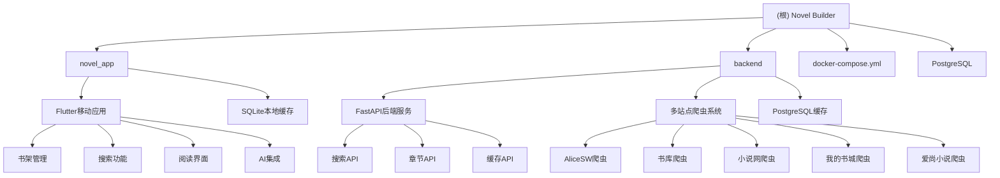

# Novel Builder - 全栈小说阅读平台

## 变更记录 (Changelog)

- **2025-11-13**: AI上下文初始化，重新设计架构文档，添加模块化结构

## 项目愿景

Novel Builder 是一个现代化的全栈小说阅读平台，采用微服务架构，提供跨平台的小说搜索、阅读、缓存和AI增强功能。平台整合多个小说站点资源，通过统一的API接口为用户提供无缝的阅读体验。

## 架构总览



## 技术栈

### 前端技术
- **Flutter 3.0+**: 跨平台移动应用框架
- **Dart SDK**: 编程语言
- **SQLite**: 本地数据存储
- **Provider**: 状态管理
- **Material Design 3**: UI设计系统

### 后端技术
- **FastAPI**: Python Web框架
- **PostgreSQL**: 主数据库
- **SQLAlchemy**: ORM框架
- **BeautifulSoup4 + lxml**: 网页爬虫
- **Playwright**: 高级网页自动化

### 基础设施
- **Docker & Docker Compose**: 容器化部署
- **Alembic**: 数据库迁移
- **OpenAPI**: API文档生成

## 模块索引

| 模块路径 | 类型 | 主要功能 | 状态 |
|---------|------|----------|------|
| [novel_app](./novel_app/CLAUDE.md) | Flutter移动应用 | 小说阅读器，搜索，缓存，AI功能 | ✅ 活跃 |
| [backend](./backend/CLAUDE.md) | FastAPI后端 | 多站点爬虫，API服务，缓存管理 | ✅ 活跃 |

## 核心功能

### 📱 移动应用功能
- **书架管理**: 本地小说收藏与阅读进度跟踪
- **智能搜索**: 跨多个小说站点的统一搜索
- **离线阅读**: 章节内容本地缓存
- **AI增强**: 基于Dify工作流的内容生成
- **用户插入章节**: 支持用户自定义章节内容

### 🌐 后端服务功能
- **多站点爬虫**: 支持5+个小说站点的内容抓取
- **智能缓存**: PostgreSQL数据库缓存优化
- **实时API**: RESTful API with OpenAPI文档
- **任务管理**: 后台缓存任务与进度跟踪
- **WebSocket**: 实时进度推送

### 🔧 基础设施功能
- **容器化部署**: Docker Compose一键部署
- **数据库管理**: PostgreSQL + Alembic迁移
- **代理支持**: 网络代理配置
- **健康检查**: 服务状态监控

## 运行与开发

### 环境要求
- Flutter SDK 3.0+
- Python 3.11+
- Docker & Docker Compose
- PostgreSQL 15+

### 快速启动

```bash
# 克隆项目
git clone <repository-url>
cd novel_builder

# 使用Docker Compose启动所有服务
docker-compose up -d

# 查看服务状态
docker-compose ps
```

### 端口映射
- **移动应用**: 3154 (开发调试)
- **后端API**: 3800 → 8000 (FastAPI)
- **数据库**: 5432 (PostgreSQL)

### 开发环境配置

创建 `.env` 文件：
```env
NOVEL_API_TOKEN=your_api_token_here
NOVEL_ENABLED_SITES=alice_sw,shukuge,xspsw,wdscw
```

## 测试策略

### 测试原则
- **功能优先**: 先实现功能，再补充测试
- **渐进测试**: 从单元测试开始，逐步增加复杂度
- **维护可控**: 测试代码维护成本不高于业务代码

### 测试覆盖率
- **Flutter应用**: 核心业务逻辑单元测试
- **后端服务**: API端点集成测试
- **爬虫功能**: 模拟站点测试

## 编码规范

### Python后端
```bash
# 代码质量检查
ruff check .          # 快速检查
pylint app/           # 深度检查
mypy app/             # 类型检查

# 代码格式化
ruff format .         # 自动格式化
black .               # 备选格式化
isort .               # 导入排序
```

### Flutter应用
```bash
# 代码分析
flutter analyze

# 代码格式化
flutter format lib/

# 测试
flutter test
```

## AI使用指引

### Claude Code集成
- 使用根级和模块级CLAUDE.md获取上下文
- 通过Mermaid图理解系统架构
- 遵循各模块的具体开发规范

### Task Master集成
- 项目已集成Task Master AI工作流
- 支持任务管理和开发流程追踪
- 使用MCP服务器进行AI增强

## 部署指南

### 生产环境部署
1. 配置环境变量
2. 设置数据库连接
3. 启用HTTPS
4. 配置反向代理
5. 设置监控和日志

### Docker部署
```bash
# 生产环境构建
docker-compose -f docker-compose.yml up -d --build

# 查看日志
docker-compose logs -f
```

## 数据库设计

### 主要表结构
- **bookshelf**: 用户书架
- **chapter_cache**: 章节内容缓存
- **novel_chapters**: 章节列表元数据
- **cache_tasks**: 缓存任务管理

### 数据库版本
- **当前版本**: v2
- **迁移工具**: Alembic
- **支持功能**: 用户插入章节保护

## API文档

### OpenAPI规范
- **文档地址**: http://localhost:3800/docs
- **规范文件**: backend/openapi.json
- **认证方式**: X-API-TOKEN header

### 主要端点
- `GET /search`: 搜索小说
- `GET /chapters`: 获取章节列表
- `GET /chapter-content`: 获取章节内容
- `POST /api/cache/create`: 创建缓存任务
- `GET /api/cache/status/{task_id}`: 查询缓存状态

## 故障排除

### 常见问题
1. **Flutter应用无法连接后端**: 检查API地址配置
2. **爬虫失败**: 检查代理设置和站点可用性
3. **数据库连接失败**: 检查PostgreSQL服务状态

### 日志查看
```bash
# 查看后端日志
docker-compose logs -f backend

# 查看数据库日志
docker-compose logs -f postgres
```

## 贡献指南

### 开发流程
1. Fork项目
2. 创建功能分支
3. 编写代码和测试
4. 提交Pull Request
5. 代码审查和合并

### 代码提交规范
- 使用清晰的提交消息
- 一个提交只做一件事
- 包含必要的测试
- 遵循代码规范

## 许可证

MIT License - 详见LICENSE文件