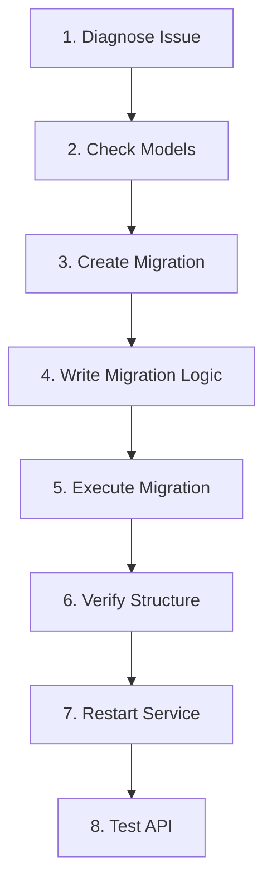

# Database Updater

## Overview

Enable database schema updates for the Novel Builder project using Alembic migrations. This skill handles the complete workflow for resolving database schema mismatches, adding new columns/tables, and maintaining database consistency across development and production environments.

## When to Use This Skill

Look for these indicators that this skill is needed:

- **Error Messages**: `psycopg2.errors.UndefinedColumn`, `column does not exist`, or similar database errors
- **Schema Mismatches**: SQLAlchemy models define fields that don't exist in the database
- **Feature Development**: New features requiring database structure changes
- **API Errors**: 400/500 errors related to database queries failing
- **Post-Deployment Issues**: Database errors after code deployments

## Database Update Workflow

Follow this workflow when database schema updates are needed:



### Step 1: Diagnose the Database Issue

Identify the specific problem from logs and error messages.

**Check backend logs for database errors:**
```bash
docker-compose logs backend --tail=100 | grep -E "(ERROR|UndefinedColumn|does not exist)"
```

**Common error patterns:**
```
psycopg2.errors.UndefinedColumn: column scene_comfyui_tasks.model_name does not exist
```

**Examine current table structure:**
```bash
docker exec novel_builder-postgres-1 psql -U novel_user -d novel_db -c "\d table_name"
```

At this stage, gather:
- The missing column name(s)
- The affected table(s)
- The expected column type (from model definitions)

### Step 2: Verify Model Definitions

Confirm that SQLAlchemy models define the missing fields before creating migrations.

**Locate the model file:**
- Model files are in: `backend/app/models/`

**Example model definition:**
```python
# backend/app/models/scene_comfyui_mapping.py
class SceneComfyUITask(Base):
    __tablename__ = "scene_comfyui_tasks"

    model_name = Column(
        String(100), nullable=True, comment="使用的模型名称"
    )
```

**Only proceed if:**
- The model file defines the missing field
- The field type and constraints are clear
- The change is intentional (not accidental model modification)

### Step 3: Create Migration File

Generate a new Alembic migration file using Docker exec.

**Create the migration:**
```bash
docker exec novel_builder-backend-1 alembic revision -m "descriptive_migration_name"
```

**Migration naming best practices:**
- Use descriptive names: `add_model_name_to_scene_comfyui_tables`
- Use snake_case
- Include affected table names when possible
- Describe the action (add, remove, modify)

**Output example:**
```
Generating /app/alembic/versions/87122bfc655a_add_model_name.py ... done
```

The migration file is created at: `backend/alembic/versions/XXXXXXXXXXXX_descriptive_name.py`

### Step 4: Write Migration Logic

Edit the migration file to implement schema changes.

**Open the generated migration file** and locate the `upgrade()` and `downgrade()` functions.

**Reference documentation for patterns:**
- Load `references/common_patterns.md` for code examples
- Load `references/alembic_workflow.md` for detailed workflow guidance

**Common migration patterns:**

**Add single column:**
```python
def upgrade() -> None:
    op.add_column(
        'table_name',
        sa.Column('column_name', sa.String(length=100), nullable=True)
    )

def downgrade() -> None:
    op.drop_column('table_name', 'column_name')
```

**Add to multiple tables:**
```python
def upgrade() -> None:
    op.add_column('table1', sa.Column('field_name', sa.String(100), nullable=True))
    op.add_column('table2', sa.Column('field_name', sa.String(100), nullable=True))

def downgrade() -> None:
    op.drop_column('table2', 'field_name')
    op.drop_column('table1', 'field_name')
```

**Important:**
- Always implement `downgrade()` for rollback capability
- Match model types exactly (String length, nullable, etc.)
- Use appropriate PostgreSQL data types
- Add comments explaining the change reason

### Step 5: Execute the Migration

Run the migration to apply database changes.

**Execute migration:**
```bash
docker exec novel_builder-backend-1 alembic upgrade head
```

**Expected success output:**
```
INFO  [alembic.runtime.migration] Context impl PostgresqlImpl.
INFO  [alembic.runtime.migration] Will assume transactional DDL.
INFO  [alembic.runtime.migration] Running upgrade xxx -> yyy, descriptive_name
```

**If migration fails:**
1. Check the error message carefully
2. Verify syntax in migration file
3. Check if column already exists
4. Fix issue and re-run or use `alembic downgrade -1` to rollback

### Step 6: Verify Database Structure

Confirm that changes were applied correctly.

**Check table structure:**
```bash
docker exec novel_builder-postgres-1 psql -U novel_user -d novel_db -c "\d table_name"
```

**Verify specific column exists:**
```bash
docker exec novel_builder-postgres-1 psql -U novel_user -d novel_db -c \
    "SELECT column_name, data_type FROM information_schema.columns \
     WHERE table_name = 'table_name' AND column_name = 'column_name';"
```

**Check migration history:**
```bash
docker exec novel_builder-backend-1 alembic history
```

### Step 7: Restart Backend Service

Restart the backend to reload model definitions.

**Restart backend service:**
```bash
docker-compose restart backend
```

**Wait for service to be healthy:**
```bash
docker-compose ps backend
# Status should show (healthy)
```

**Check startup logs:**
```bash
docker logs novel_builder-backend-1 --tail=30
```

### Step 8: Test API Functionality

Verify that the original issue is resolved.

**Test the affected API endpoint:**
```bash
curl -H "X-API-TOKEN: test_token_123" \
     http://localhost:3800/api/affected-endpoint
```

**Check for errors in recent logs:**
```bash
docker logs novel_builder-backend-1 --tail=50 | grep -E "(ERROR|WARNING)"
```

**Success indicators:**
- API returns 200 OK (not 400/500)
- No database column errors in logs
- Expected data is returned in response

## Advanced Operations

### Rollback a Migration

**Rollback one version:**
```bash
docker exec novel_builder-backend-1 alembic downgrade -1
```

**Rollback to specific revision:**
```bash
docker exec novel_builder-backend-1 alembic downgrade <revision_id>
```

### Check Current Database Version

```bash
docker exec novel_builder-backend-1 alembic current
```

### View All Migrations

```bash
docker exec novel_builder-backend-1 alembic history
```

## Troubleshooting

### Issue: Migration Fails with "column already exists"

**Cause:** Column was added manually or migration was partially applied

**Solution:**
1. Check if column exists: `\d table_name`
2. If exists, mark migration as complete: `alembic stamp head`
3. Or rollback and fix migration logic

### Issue: Backend Shows "unhealthy" After Migration

**Cause:** Migration broke database consistency

**Solution:**
1. Check backend logs: `docker logs novel_builder-backend-1 --tail=100`
2. Rollback migration if needed
3. Verify migration logic matches model definition
4. Re-run migration after fixing

### Issue: Model Definition Doesn't Match Database

**Cause:** Model was changed but migration wasn't created

**Solution:**
1. Revert model change if accidental
2. Or create migration to add missing fields
3. Always pair model changes with migrations

## Best Practices

1. **Test First:** Always test migrations in development environment first
2. **Backup:** Backup production database before migrations
3. **Descriptive Names:** Use clear, descriptive migration names
4. **Rollback Ready:** Always implement `downgrade()` function
5. **Verify:** Always verify after migration execution
6. **Document:** Add comments explaining why changes are needed
7. **Pair Changes:** Never change models without creating migrations

## Quick Reference Commands

```bash
# Create migration
docker exec novel_builder-backend-1 alembic revision -m "description"

# Execute migration
docker exec novel_builder-backend-1 alembic upgrade head

# Rollback one version
docker exec novel_builder-backend-1 alembic downgrade -1

# Check current version
docker exec novel_builder-backend-1 alembic current

# View table structure
docker exec novel_builder-postgres-1 psql -U novel_user -d novel_db -c "\d table_name"

# Restart backend
docker-compose restart backend

# View logs
docker logs novel_builder-backend-1 --tail=50
```

## Resources

### references/alembic_workflow.md
Comprehensive guide for Alembic migration workflow. Load this document for:
- Detailed step-by-step procedures
- Docker environment specifics
- Advanced Alembic operations
- Troubleshooting detailed solutions
- File locations and project structure

### references/common_patterns.md
Code pattern library for common database changes. Load this document for:
- Copy-paste ready migration code examples
- Data type mappings
- Multi-table update patterns
- Constraint and index creation
- Real-world migration examples

**Usage:** Load these reference documents when working on complex migrations or needing specific code patterns.
