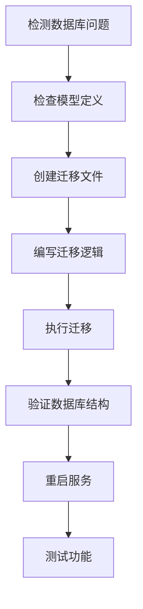

# Alembic 数据库迁移工作流程

本文档详细说明在 Novel Builder 项目中使用 Alembic 进行数据库迁移的完整流程。

## 迁移工作流程概览



## 详细步骤

### 1. 检测数据库问题

**常见错误信号：**
```
psycopg2.errors.UndefinedColumn: column table_name.column_name does not exist
```

**诊断方法：**
```bash
# 查看后端日志
docker-compose logs backend --tail=100

# 检查特定表的当前结构
docker exec novel_builder-postgres-1 psql -U novel_user -d novel_db -c "\d table_name"
```

### 2. 检查模型定义

确认 SQLAlchemy 模型中已定义字段：

```python
# backend/app/models/scene_comfyui_mapping.py
class SceneComfyUITask(Base):
    __tablename__ = "scene_comfyui_tasks"

    model_name = Column(
        String(100), nullable=True, comment="使用的模型名称"
    )
```

### 3. 创建迁移文件

**在 Docker 容器中创建：**
```bash
docker exec novel_builder-backend-1 alembic revision -m "描述性消息"
```

**在本地创建（需安装 Alembic）：**
```bash
cd backend
alembic revision -m "描述性消息"
```

生成的迁移文件位于：`backend/alembic/versions/XXXXXXXXXXXX_descriptive_message.py`

### 4. 编写迁移逻辑

编辑迁移文件，实现 `upgrade()` 和 `downgrade()` 函数。

**添加单个列：**
```python
def upgrade() -> None:
    op.add_column(
        'table_name',
        sa.Column('column_name', sa.String(length=100), nullable=True)
    )

def downgrade() -> None:
    op.drop_column('table_name', 'column_name')
```

**添加多个列：**
```python
def upgrade() -> None:
    # 为 table1 添加字段
    op.add_column(
        'table1',
        sa.Column('model_name', sa.String(length=100), nullable=True)
    )

    # 为 table2 添加字段
    op.add_column(
        'table2',
        sa.Column('model_name', sa.String(length=100), nullable=True)
    )

def downgrade() -> None:
    op.drop_column('table2', 'model_name')
    op.drop_column('table1', 'model_name')
```

**常见列类型：**
- `sa.String(length=255)` - 字符串
- `sa.Integer()` - 整数
- `sa.Boolean()` - 布尔值
- `sa.DateTime(timezone=True)` - 时间戳
- `sa.Text()` - 长文本

### 5. 执行迁移

**在 Docker 容器中执行：**
```bash
docker exec novel_builder-backend-1 alembic upgrade head
```

**预期输出：**
```
INFO  [alembic.runtime.migration] Context impl PostgresqlImpl.
INFO  [alembic.runtime.migration] Will assume transactional DDL.
INFO  [alembic.runtime.migration] Running upgrade xxx -> yyy, description
```

### 6. 验证数据库结构

```bash
# 检查表结构
docker exec novel_builder-postgres-1 psql -U novel_user -d novel_db -c "\d table_name"

# 验证新列存在
docker exec novel_builder-postgres-1 psql -U novel_user -d novel_db -c \
    "SELECT column_name FROM information_schema.columns WHERE table_name = 'table_name';"
```

### 7. 重启服务

```bash
docker-compose restart backend
```

等待服务启动完成：
```bash
docker-compose ps backend
# 状态应显示 (healthy)
```

### 8. 测试功能

```bash
# 测试相关 API 端点
curl -H "X-API-TOKEN: test_token_123" http://localhost:3800/api/endpoint

# 查看最新日志确认无错误
docker logs novel_builder-backend-1 --tail=30 | grep -E "(ERROR|WARNING)"
```

## 高级操作

### 查看迁移历史

```bash
docker exec novel_builder-backend-1 alembic history
```

### 回滚到特定版本

```bash
docker exec novel_builder-backend-1 alembic downgrade <revision_id>
```

### 回滚一个版本

```bash
docker exec novel_builder-backend-1 alembic downgrade -1
```

### 查看当前版本

```bash
docker exec novel_builder-backend-1 alembic current
```

## 故障排除

### 迁移执行失败

**原因：**
- 迁移逻辑有语法错误
- 数据库连接问题
- 列已存在

**解决：**
1. 检查迁移文件语法
2. 查看详细错误信息
3. 必要时手动修复数据库或回滚

### 服务无法启动

**原因：**
- 数据库迁移失败
- 模型定义与数据库不匹配

**解决：**
1. 检查数据库迁移状态
2. 验证表结构
3. 查看服务日志：`docker logs novel_builder-backend-1 --tail=100`

### 数据库校验警告

```
WARNING: database "novel_db" has no actual collation version
```

这是非关键警告，不影响功能。可通过以下命令修复（可选）：
```bash
docker exec novel_builder-postgres-1 psql -U novel_user -d novel_db -c "ALTER DATABASE novel_db REFRESH COLLATION VERSION;"
```

## 最佳实践

1. **命名规范**：使用描述性迁移名称，如 `add_model_name_to_scene_comfyui_tables`
2. **可回滚**：始终实现 `downgrade()` 函数
3. **测试**：在开发环境先测试迁移
4. **备份**：生产环境迁移前备份数据库
5. **验证**：迁移后立即验证表结构和功能
6. **文档**：在迁移代码中添加注释说明变更原因

## 相关文件位置

- 迁移目录：`backend/alembic/versions/`
- 模型定义：`backend/app/models/`
- Alembic 配置：`backend/alembic.ini`
