# Novel Builder 移动应用功能介绍

> 🚀 **创新阅读体验，AI增强的小说世界探索器**

[](https://flutter.dev)
[](https://fastapi.tiangolo.com)
[](#)
[](#)

## 📱 产品概述

### 项目定位

Novel Builder 是一款革命性的 **AI增强型小说阅读应用**，它彻底颠覆了传统的阅读体验。通过融合先进的人工智能技术，我们为读者打造了一个沉浸式的多媒体小说世界，让阅读不再是单向的文字接收，而是与角色互动、场景可视化的全方位体验。

### 核心价值主张

- **🎭 角色与你同在**: AI生成的角色卡让小说人物栩栩如生
- **🎬 场景动态呈现**: 静态插图转换为生动的Live Photo视频
- **🧠 智能内容生成**: DSL Engine 本地工作流 + Hermes Agent 智能对话
- **📚 跨平台阅读体验**: Android、iOS、Windows全平台支持
- **🔋 无缝离线阅读**: 智能缓存确保任何环境下的畅快阅读

### 技术架构概览

```
┌─────────────────┐    ┌─────────────────┐    ┌─────────────────┐
│   Flutter App   │◄──►│   FastAPI 后端  │◄──►│   AI 服务       │
│                 │    │                 │    │                 │
│ • Material UI   │    │ • RESTful API   │    │ • DSL Engine    │
│ • SQLite 本地库 │    │ • PostgreSQL    │    │ • Hermes Agent  │
│ • 多媒体缓存    │    │ • Scrapling 爬虫│    │ • ComfyUI 图片  │
│ • 离线支持      │    │ • WebSocket     │    │ • LLM 对话      │
└─────────────────┘    └─────────────────┘    └─────────────────┘
```

---

## 📖 核心阅读功能

### 🏠 个人书架管理

**界面展示**：
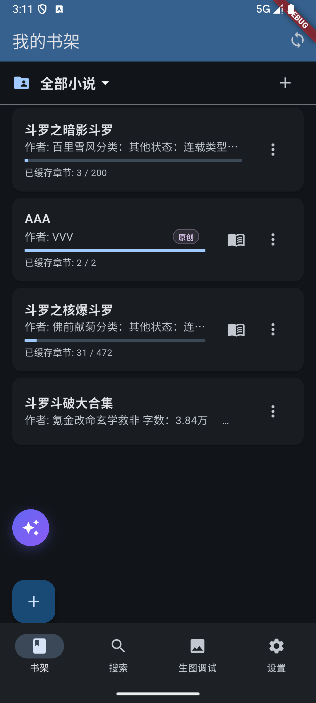

**功能亮点**：

- **📚 网格化书架展示**: 封面美观的网格布局，所有收藏小说一目了然
- **📊 阅读进度可视化**: 实时显示每本书的阅读进度和章节缓存状态（已缓存章节 / 总章节数）
- **📂 多书架分类**: 支持创建多个书架（如「我的收藏」「玄幻小说」等），通过顶部下拉菜单切换
- **➕ 一键添加小说**: 通过顶部 + 按钮或左下角紫色快捷入口快速添加
- **🔄 自动获取元数据**: 一键添加后自动获取封面、作者、简介、分类等信息
- **💾 本地存储**: SQLite数据库 v21 版本，离线访问无忧

**用户体验**：
```
📚 书架展示 → 网格化布局，封面美观
📊 进度显示 → 已读/未读章节一目了然
🔄 自动缓存 → 应用活跃时后台静默缓存
💾 本地存储 → SQLite数据库，快速访问
```

### 🔍 智能搜索系统

**界面展示**：


**强大搜索能力**：

- **🌐 跨站点统一搜索**: 同时搜索多个小说站点，一次获取全面结果
- **🎯 智能结果聚合**: 自动去重，按相关度排序
- **🔎 源站过滤**: 可选择特定站点进行精准搜索
- **⚡ 实时反馈**: 搜索结果即时显示，包含详细信息

**支持的站点**：

- 📚 **书库 (Shukuge)** - 综合性小说书库
- 📱 **顶点小说 (Ddxsmf)** - 外部搜索引擎
- 🏛️ **我的书城 (Wdscw)** - 精品小说免费阅读
- 🌬️ **微风小说 (Wfxs)** - 搜索支持
- 📖 **笔趣阁543 (Biquge543)** - 搜索限流
- 更多站点持续添加中...

**搜索流程**：
```
输入关键词 → 并行请求多站点 → 结果聚合去重 → 展示搜索结果 → 一键添加/阅读
```

### 📖 沉浸式阅读器

**界面展示**：
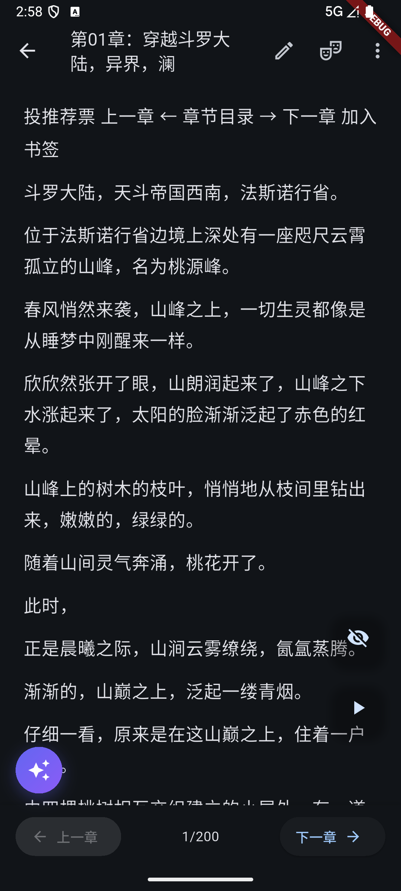

**核心阅读功能**：

- **📜 流畅翻页**: 支持滑动翻页、点击翻页，提供多种翻页动画
- **🎨 个性化设置**: 字体大小调节、亮色/暗色主题切换、背景色自定义
- **🧭 智能导航**: 章节列表快速跳转、左右滑动手势操作
- **📑 章节进度显示**: 实时显示 `1/200` 这样的当前页/总页数
- **🔖 上一章 / 下一章**: 底部一键切换章节
- **🖍️ 内容增强**: 支持文本高亮、段落选择、关键词搜索

**高级功能**：

- **✍️ 用户创作空间**: 支持用户插入自定义章节内容
- **🛡️ 编辑保护**: 用户添加的章节不会被自动更新覆盖
- **📈 阅读统计**: 记录阅读时间、速度等数据
- **🔖 书签管理**: 支持添加、编辑、删除书签
- **💬 投推荐票**: 阅读时直接为喜欢的小说投票
- **🧠 AI 伴读设置**: 在阅读过程中获得 AI 辅助理解

### 📚 章节列表管理

**界面展示**：
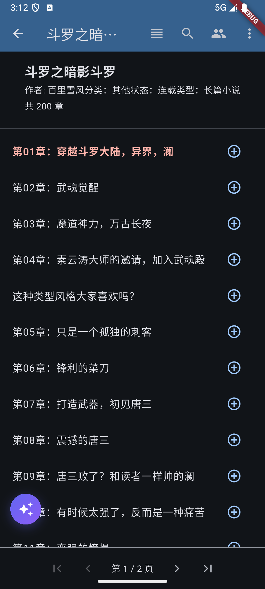

**功能特色**：

- **📋 完整章节列表**: 显示小说全部章节，按顺序排列
- **🔍 章节内搜索**: 顶部搜索按钮快速搜索章节内容
- **👤 角色入口**: 顶部角色图标直接进入角色管理
- **📑 分页浏览**: 大型小说分页显示（每页100章），支持翻页
- **➕ 快速添加**: 每章右侧加号按钮支持单章缓存

### 📋 章节操作菜单

**界面展示**：
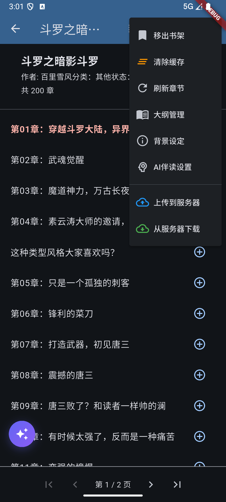

**快捷操作**：

- **📤 移出书架**: 将小说从书架移除（保留缓存）
- **🗑️ 清除缓存**: 一键清除已下载的章节内容
- **🔄 刷新章节**: 重新拉取最新章节列表
- **📝 大纲管理**: 进入全书大纲管理
- **🌍 背景设定**: 查看/编辑小说背景设定
- **🤖 AI 伴读设置**: 配置 AI 伴读相关参数
- **☁️ 上传到服务器**: 将本地数据同步到后端
- **📥 从服务器下载**: 从后端拉取之前同步的数据

### 🔋 离线阅读能力

**智能缓存策略**：

- **📦 分层缓存**: 内存缓存 → 数据库缓存 → 文件缓存
- **⭐ 优先级管理**: 最近阅读的小说优先缓存
- **🧹 空间优化**: 智能清理过期缓存，控制存储使用
- **🔄 后台更新**: 不影响用户体验的情况下静默更新内容

**离线体验**：
```
✅ 已缓存章节完全离线可用
✅ 阅读进度本地保存，联网后自动同步
✅ 角色信息和插图本地缓存
✅ 搜索历史和用户偏好本地存储
```

---

## 🤖 AI增强功能

### 🤖 Hermes AI 助手

**界面展示**：
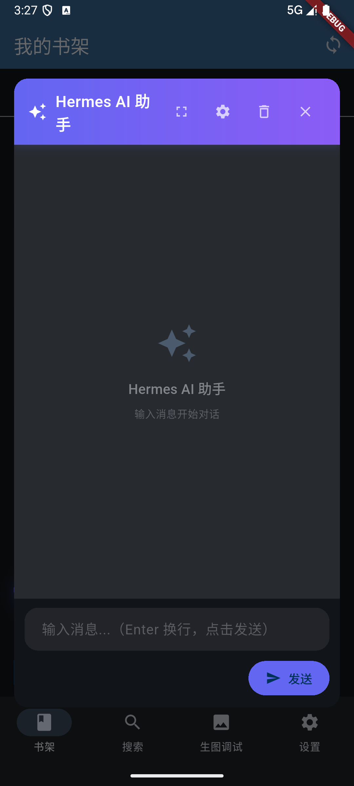

**核心功能**：

- **💎 全局浮窗入口**: 左下角紫色星星按钮可随时呼出 Hermes AI 助手
- **🪟 多模式窗口**: 支持全屏、设置、删除对话、关闭等多种操作
- **💬 流式对话**: 基于 OpenAI 兼容 API 的智能对话助手
- **🔀 多角色聊天**: 支持单角色 / 多角色切换，与小说人物自由对话
- **🎭 沉浸式聊天**: 通过对话框气泡模式，沉浸式与角色互动
- **🛠️ 工具调用**: 支持 navigate_to、evaluateJs 等工具，AI 可操作 WebView 完成复杂任务

**应用场景**：
```
✓ 阅读中遇到问题随时询问
✓ 与小说角色进行互动对话
✓ 让 AI 帮你分析情节、人物
✓ 探索不同的故事走向
```

### 🧠 DSL Engine 本地工作流

**核心特性**：

- **🔧 Dify 工作流复刻**: 客户端实现 Dify 工作流核心能力
- **📝 结构化信息提取**: 自动从章节内容提取角色、关系、背景等结构化信息
- **✍️ 创意写作支持**: 段落重写、全文重写、续写等
- **📊 摘要生成**: 章节摘要、背景摘要、剧情摘要
- **🎨 插图提示词生成**: 自动生成适合的 AI 绘画提示词
- **🔄 流式响应**: 实时显示生成过程，提升体验
- **🛠️ 工具化设计**: 简单 YAML DSL 定义工作流，易于扩展

**工作流示意**：
```
输入文本 → DSL 解析 → 工作流编排 → 节点执行（LLM/工具）→ 流式输出
```

### 👥 角色卡生成系统

**界面展示（角色列表）**：


**界面展示（角色编辑）**：
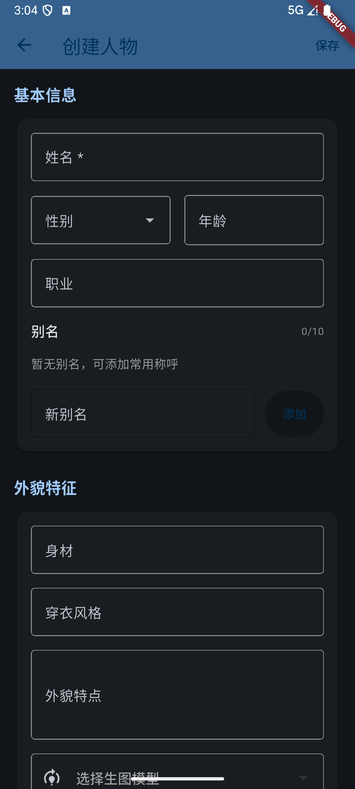

**完整角色管理**：

#### 角色属性信息
- **基本信息**: 姓名、性别、年龄、职业
- **外貌特征**: 身材、穿衣风格、外貌特点
- **性格特点**: 性格描述、行为习惯
- **背景故事**: 角色经历、人际关系
- **别名管理**: 支持添加最多 10 个常用称呼
- **AI 作家设定**: 自由编辑 AI 生成角色设定的 prompt

#### AI 生成能力
- **🎨 多角度生成**: 头像、半身像、全身像多种选择
- **🖌️ 风格定制**: 支持不同艺术风格的角色形象
- **🖼️ 生图模型选择**: 支持多种 AI 生图模型切换
- **📚 图集管理**: 角色多张图片的浏览和管理

**AI生成流程**：
```
1. 阅读过程识别新角色
2. 用户填写详细角色信息
3. AI 基于描述生成角色头像
4. 角色信息自动同步到后续 AI 生成
```

### 📊 大纲管理系统

**界面展示**：
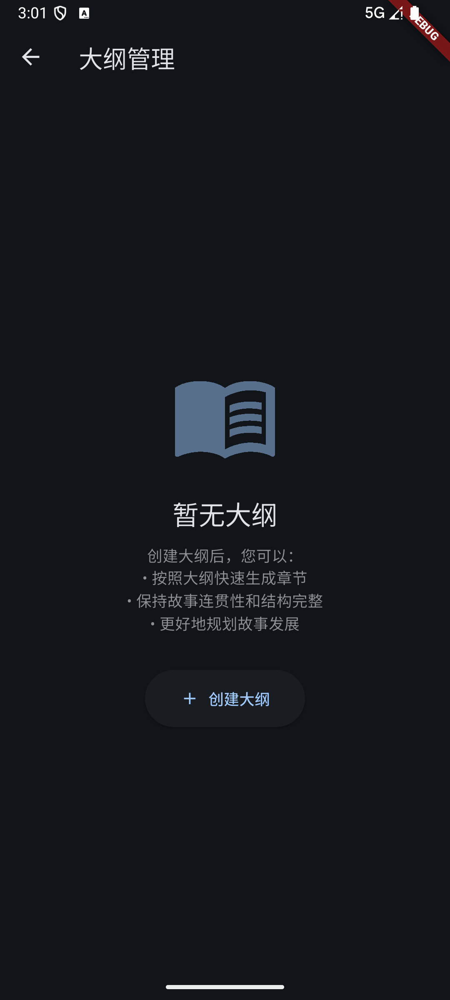

**功能特色**：

- **📚 全书大纲**: 创建、查看、编辑、删除小说的整体大纲
- **📝 章节细纲**: 为每个章节创建详细的细纲草稿
- **🔄 大纲与章节集成**: 章节列表中显示对应大纲信息
- **🤖 AI 辅助生成**: 通过 DSL Engine 自动生成大纲
- **🔗 章节快速生成**: 按照大纲快速生成章节，保持故事连贯性

**核心价值**：
```
✓ 保持故事连贯性和结构完整
✓ 按照大纲快速生成章节
✓ 更好地规划故事发展
```

### 🎨 场景插图绘制

**界面展示**：
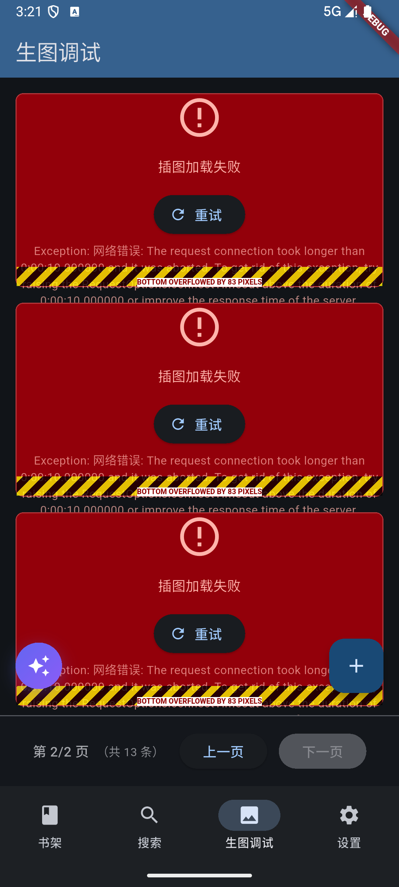

**智能场景理解**：

- **📝 段落智能识别**: 自动提取场景描述和关键元素
- **👥 多角色支持**: 可选择当前场景中的出场角色
- **📍 位置管理**: 支持在段落前后、章节任意位置插入插图
- **🎬 批量生成**: 一次请求生成多张不同角度的场景插图
- **🛠️ 调试模式**: 内置生图调试页，方便排查生成问题

**用户工作流**：
```
选择段落 → 设置角色 → 调整参数 → AI 生成插图 → 插入位置选择 → 完成嵌入
```

**技术实现**：
- 使用 `SceneIllustrationService` 管理插图生成任务
- 支持多种 AI 模型选择和参数调整
- 实时任务状态跟踪和进度显示
- 自动在章节内容中插入媒体标记
- 内置 `IllustrationDebugScreen` 用于调试

### 🎬 图生视频技术

**创新视频功能**：

- **🎞️ Live Photo 效果**: 5秒短视频循环播放，类似 iOS 的 Live Photo
- **🤖 智能动态化**: 基于静态图片，用户描述想要的动态效果
- **🔄 无缝集成**: 视频生成完成后自动替换静态插图
- **⚡ 性能优化**: 使用 `VideoCacheManager` 统一管理，避免内存泄漏

**视频生成示例**：
```dart
// 用户交互流程
选择插图 → 输入动态描述 → AI 生成视频 → 自动播放循环
```

**描述示例**：
- "角色微微转头，露出微笑"
- "风吹动树叶，光影变化"
- "水波荡漾，倒影清晰"
- "角色眨眼，表情生动"

**播放控制**：
- **智能可见性检测**: 只有在屏幕可见时播放视频
- **应用生命周期管理**: 应用进入后台时自动暂停
- **资源统一管理**: 最多缓存 10 个视频控制器，避免内存溢出

---

## ⚙️ 系统与设置

### 🛠️ 主设置页

**界面展示**：
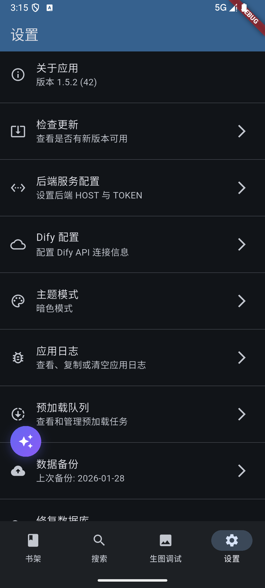
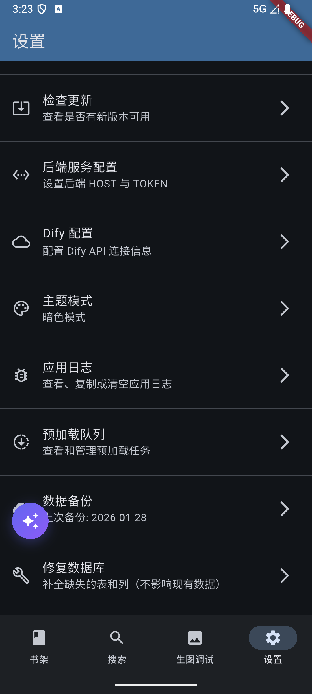

**完整功能列表**：

- **ℹ️ 关于应用**: 显示当前应用版本信息
- **🔄 检查更新**: 一键检查是否有新版本可用
- **🔌 后端服务配置**: 配置 FastAPI 后端地址和 Token
- **🤖 Dify 配置**: 配置 DSL Engine 的 API URL 和 Token
- **🎨 主题模式**: 切换亮色/暗色/跟随系统
- **📋 应用日志**: 查看、筛选、搜索、复制、删除应用日志
- **📦 预加载队列**: 查看和管理预加载任务
- **☁️ 数据备份**: 一键备份本地数据到文件
- **🛠️ 修复数据库**: 补全缺失的表和列，保障数据完整性

### 🤖 Dify / AI 配置

**界面展示**：
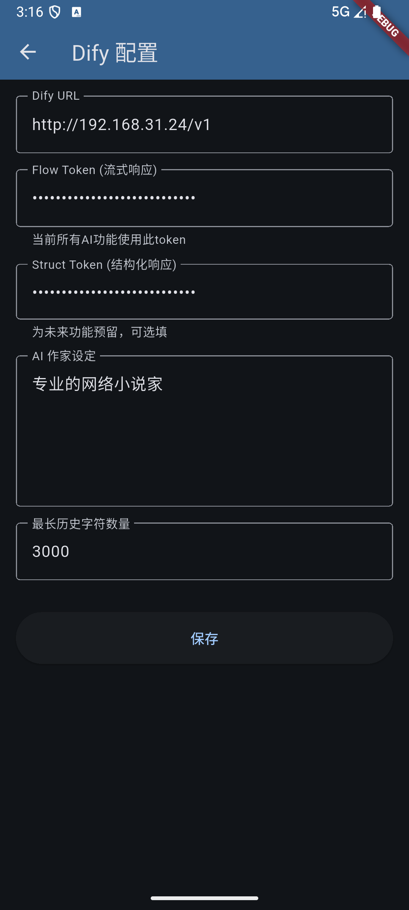

**配置项**：

- **Dify URL**: DSL Engine 服务的 API 地址（如 `http://192.168.31.24/v1`）
- **Flow Token (流式响应)**: 用于所有 AI 功能的鉴权 token
- **Struct Token (结构化响应)**: 为未来功能预留的可选 token
- **AI 作家设定**: 自定义 AI 写作的人设 prompt（如「专业的网络小说家」）
- **最长历史字符数量**: 控制 LLM 上下文窗口（如 3000 字符）

### 🔌 后端服务配置

**界面展示**：
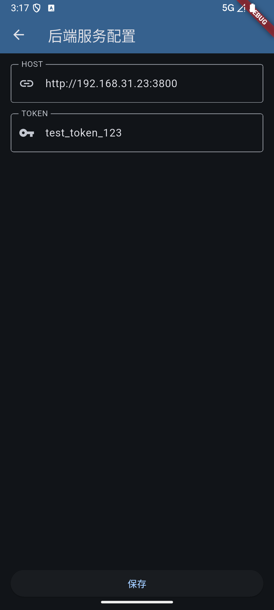

**配置项**：

- **HOST**: FastAPI 后端服务地址（如 `http://192.168.31.23:3800`）
- **TOKEN**: API 调用鉴权 Token

### 📋 应用日志查看器

**界面展示**：
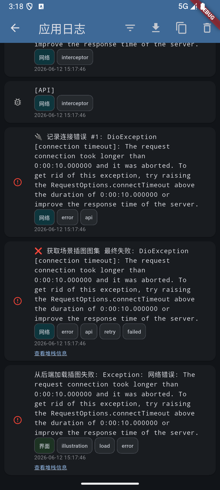

**功能特色**：

- **🏷️ 模块化标签**: 按网络、API、界面、插图等模块分类日志
- **🔍 错误堆栈查看**: 详细异常堆栈信息一键展开
- **📋 复制功能**: 快速复制日志内容
- **📥 下载日志**: 保存日志到本地文件
- **🗑️ 批量删除**: 一键清空无用日志
- **🎯 多级过滤**: 按级别（INFO/WARN/ERROR）和模块过滤

### 📦 预加载队列调试

**界面展示**：
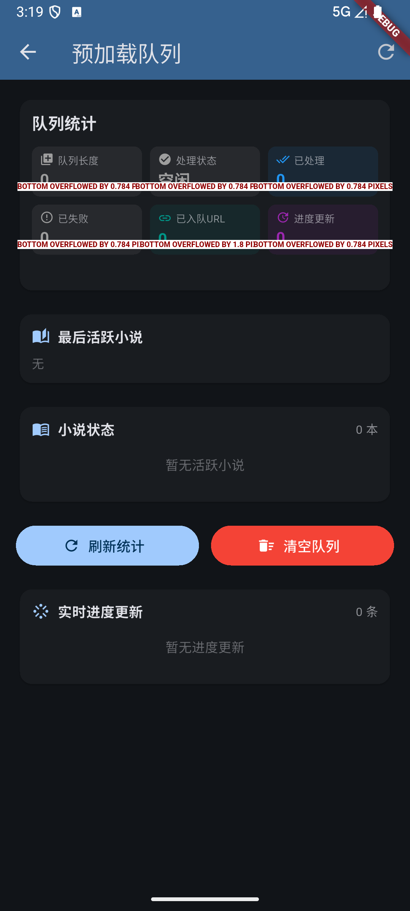

**统计指标**：

- **队列长度**: 当前待处理任务数
- **处理状态**: 空闲 / 处理中
- **已处理**: 已完成任务数
- **已失败**: 失败任务数
- **已入队 URL**: 已加入队列的 URL 数量
- **进度更新**: 实时进度推送数

**功能**：

- **🔄 刷新统计**: 手动刷新队列状态
- **🗑️ 清空队列**: 一键清空所有任务
- **📖 最后活跃小说**: 显示最近活动的小说
- **📊 小说状态**: 列出当前所有活跃小说

### 🎨 主题模式

**界面展示**：
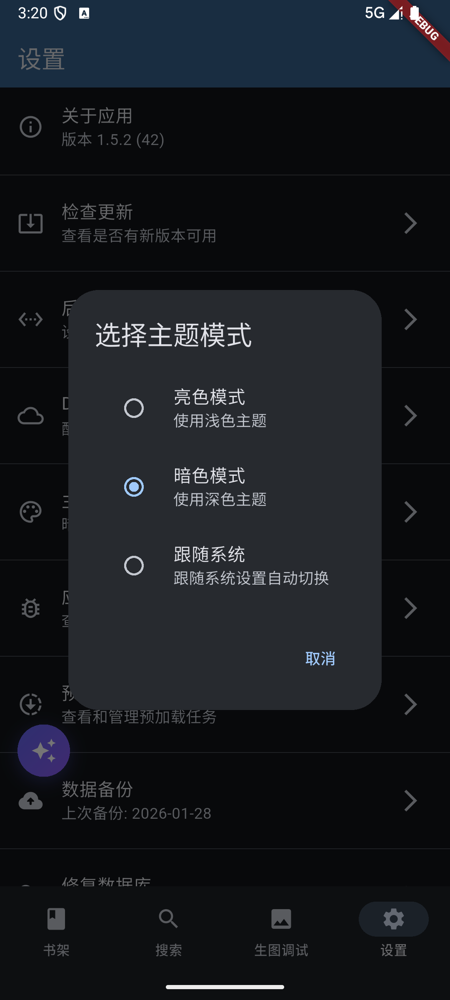

**三档可选**：

- **☀️ 亮色模式**: 使用浅色主题，护眼阅读
- **🌙 暗色模式**: 使用深色主题，夜间沉浸阅读（默认）
- **🔄 跟随系统**: 跟随系统设置自动切换

### 📁 书架管理

**界面展示**：


**功能特色**：

- **📚 多书架分类**: 创建多个书架分类管理不同类型小说
- **➕ 快速创建**: 一键新建书架，输入名称即可
- **🔄 切换分类**: 顶部下拉菜单快速切换书架
- **🗂️ 书架与小说多对多**: 一本小说可属于多个书架

---

## 🎯 用户使用流程

### 🆕 新用户引导

**首次使用流程**：
```
1. 欢迎页面 → 介绍应用特色功能
2. 权限请求 → 存储权限、网络权限
3. 服务器配置 → 设置后端 API 地址和 Token
4. AI 配置 → 配置 Dify / DSL Engine API
5. 功能导览 → 各个功能模块的简单介绍
6. 开始使用 → 进入搜索页面，开始阅读之旅
```

### 📚 核心功能操作路径

**阅读一本书的完整流程**：
```
搜索小说 → 查看详情 → 添加到书架 → 开始阅读 → 体验 AI 功能
```

**AI增强阅读体验**：
```
遇到新角色 → 创建角色卡 → 生成角色图片 → 识别关键场景 → 生成场景插图 → 转换为视频
```

### 🛠️ 高级功能使用

**Hermes AI 智能对话**：
```
阅读过程中 → 点击左下角紫色星星 → 呼出 Hermes → 输入问题 → 流式获得回答
```

**大纲驱动创作**：
```
创建大纲 → 添加章节细纲 → AI 辅助生成 → 章节快速生成 → 保持故事连贯
```

**设置和管理**：
```
设置页面 → 后端服务配置 → AI 配置 → 主题切换 → 缓存管理 → 导出数据
```

**数据同步**：
```
本地数据 → 云端同步 → 多设备一致 → 冲突解决 → 数据恢复
```

---

## 💡 技术特色亮点

### 🎨 Material Design 3 界面

**现代化设计语言**：

- **🌓 自适应主题**: 跟随系统自动切换亮色/暗色主题
- **✨ 流畅动画**: 页面切换、元素交互动画效果
- **♿ 无障碍设计**: 支持大字体、高对比度等辅助功能
- **📱 响应式布局**: 适配手机、平板、桌面等不同屏幕

### ⚡ 性能优化策略

**多线程处理**：

- **🧵 异步网络请求**: 不阻塞 UI 线程的后台数据获取
- **📋 后台任务队列**: 缓存任务、AI 生成任务的队列化管理
- **🔮 智能预加载**: 根据用户行为预测性加载内容

**内存管理**：

- **♻️ 资源池化**: 图片、视频等资源的统一管理和复用
- **🧹 自动释放**: 页面销毁时及时释放相关资源
- **📊 内存监控**: 实时监控内存使用，防止内存泄漏

### 🏗️ 状态管理架构

**Riverpod 状态管理**：

- ✅ 50+ Provider 统一管理
- ✅ 注解 + 代码生成（`riverpod_generator`）
- ✅ `ConsumerWidget` + `ref.watch/read/listen` 模式
- ✅ `StateNotifierProvider` 管理可变状态
- ✅ `FutureProvider` / `StreamProvider` 异步数据

### 🔄 跨平台一致性

**Flutter跨平台优势**：

- **📦 单一代码库**: 一套代码支持 Android、iOS、Windows 多平台
- **⚡ 原生性能**: 编译为原生代码，性能媲美原生应用
- **🎨 平台特性**: 充分利用各平台特性和设计规范
- **🔄 数据同步**: 跨设备数据无缝同步和一致性

### 🔒 数据安全保护

**多重安全机制**：

- **🔐 本地加密**: 敏感数据本地加密存储
- **🌐 传输安全**: HTTPS/TLS 加密传输
- **🛡️ 访问控制**: API 令牌认证和权限管理
- **🔒 隐私保护**: 用户数据最小化收集原则

---

## 🏆 项目价值和优势

### 🆚 相比传统阅读器的优势

| 功能特性 | 传统阅读器 | Novel Builder |
|---------|-----------|---------------|
| **阅读方式** | 纯文字阅读 | 多媒体沉浸式阅读 |
| **角色理解** | 读者想象 | AI 生成可视化角色 |
| **场景体验** | 文字描述 | 动态插图和视频 |
| **内容创作** | 只能阅读 | 支持用户创作和插入 |
| **AI 辅助** | 无 | DSL Engine + Hermes Agent 双引擎 |
| **离线阅读** | 部分支持 | 智能分层缓存 |
| **跨平台** | 单平台 | Android/iOS/Windows 全平台 |
| **技术先进性** | 基础功能 | AI 驱动的智能体验 |

### 🚀 AI 技术创新点

**核心技术突破**：

- **🔍 角色识别和管理**: AI 辅助的角色信息提取和管理
- **🎨 场景可视化**: 从文字到图像、再到视频的完整转换链
- **🧠 智能内容生成**: 基于上下文的 AI 内容创作和扩展
- **🔗 多模态融合**: 文字、图像、视频的无缝集成体验
- **🛠️ 本地工作流**: 客户端 DSL Engine，无云端依赖
- **🤖 智能代理**: Hermes Agent 支持工具调用，AI 可操作应用

### 💫 用户体验提升

**阅读体验革命**：

- **🎮 参与感增强**: 从被动阅读转向主动参与创作
- **📚 理解加深**: 可视化帮助用户更好地理解角色和场景
- **❤️ 情感共鸣**: 生动的多媒体内容增强情感体验
- **🎨 个性化定制**: 每个用户都能创造独一无二的阅读体验
- **💬 实时互动**: 通过 Hermes AI 与角色实时对话

### 🎯 目标用户群体

**主要用户画像**：

- **📖 小说爱好者**: 寻求更丰富阅读体验的读者
- **🤖 AI 科技爱好者**: 对新技术应用感兴趣的用户
- **✍️ 内容创作者**: 喜欢参与内容创作和分享的用户
- **🎮 年轻读者**: 追求创新体验和新奇技术的用户
- **🎓 学习者**: 利用 AI 工具进行写作学习和创作的用户

---

## 📸 截图索引

应用所有功能模块的界面截图：

| 截图 | 功能模块 | 描述 |
|------|---------|------|
| `01-bookshelf.png` | 书架管理 | 个人书架主界面 |
| `02-search.png` | 搜索功能 | 小说搜索主界面 |
| `03-settings.png` | 设置 | 应用设置主界面 |
| `04-chapter-list.png` | 章节列表 | 章节列表与导航 |
| `05-reader.png` | 阅读器 | 沉浸式阅读界面 |
| `06-chapter-more.png` | 章节操作 | 章节快捷操作菜单 |
| `07-ai-accompaniment.png` | 大纲管理 | 大纲管理空状态 |
| `09-character-management.png` | 角色管理 | 角色列表（空状态） |
| `10-character-edit.png` | 角色编辑 | 角色信息编辑表单 |
| `11-dify-settings.png` | AI 配置 | Dify / DSL Engine 配置 |
| `12-backend-settings.png` | 后端配置 | 后端服务地址配置 |
| `13-log-viewer.png` | 日志查看 | 应用日志查看器 |
| `14-preload-queue.png` | 预加载队列 | 预加载任务队列调试 |
| `15-theme-mode.png` | 主题模式 | 主题切换对话框 |
| `16-illustration-debug.png` | 场景插图 | 插图生成调试页 |
| `17-settings-scrolled.png` | 设置（底部） | 设置页底部功能 |
| `18-add-novel.png` | 书架分类 | 新建书架分类对话框 |
| `20-hermes-ai.png` | Hermes AI | 智能对话助手浮窗 |

---

## 📞 联系与反馈

- **项目地址**: [GitHub Repository](https://github.com/yunkst/novel_builder)
- **问题反馈**: [Issues](https://github.com/yunkst/novel_builder/issues)
- **功能建议**: [Discussions](https://github.com/yunkst/novel_builder/discussions)

---

> **Novel Builder** - 重新定义阅读体验，让每一个故事都活起来！

*最后更新: 2026-06-12*
